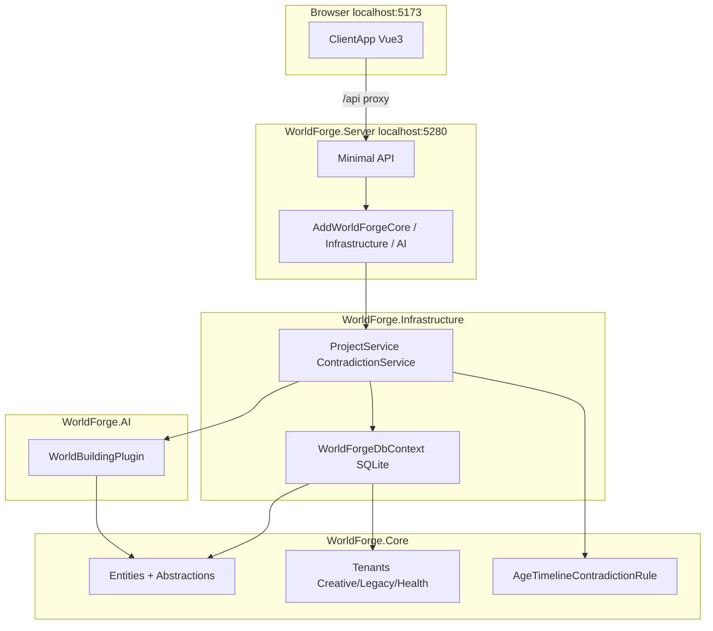
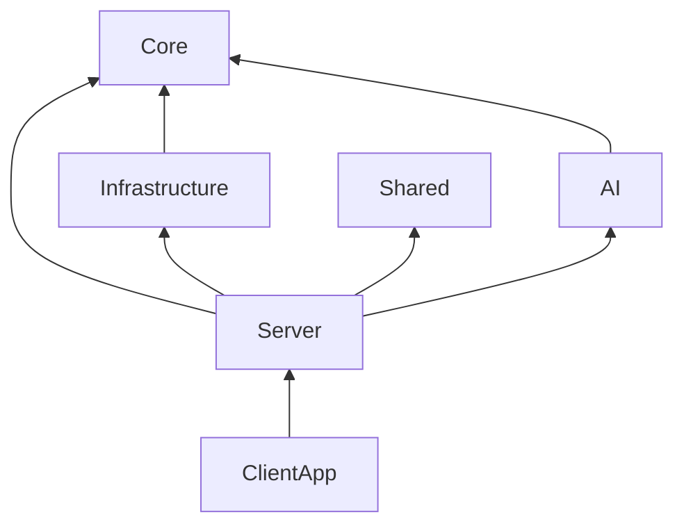

# 01 — 系统全景与项目结构

> **立项参考**：[reference/01-架构总览.md](./reference/01-架构总览.md)（C4 愿景、竞品）

---

## 一、运行时全景



**MVP 实际路径**：浏览器 → Vite 开发服 → 代理 `/api` → ASP.NET → SQLite（`Server/Data/worldforge.dev.db`）。

Ollama、PostgreSQL、PWA 离线壳：**未接入**（见 10、12）。

---

## 二、逻辑分层

| 层 | 项目 | 职责 |
|----|------|------|
| 表现 | `ClientApp` | 页面、Pinia、调用 REST |
| 宿主 | `WorldForge.Server` | HTTP、CORS、DI 组合 |
| 应用编排 | `WorldForge.Infrastructure` | EF、Project/Contradiction 服务 |
| 领域 | `WorldForge.Core` | 实体、租户、规则接口与实现 |
| 智能 | `WorldForge.AI` | `IContradictionDetectionPlugin` 实现 |
| 契约 | `WorldForge.Shared` | API DTO |

---

## 三、项目依赖



**硬约束**

- `Core` 不引用 `Infrastructure`、`AI`、`Server`
- `AI` 不引用 `Infrastructure`
- 租户差异不进 `if/else`，走 `ITenantTemplate`

---

## 四、仓库目录

```
WorldForge/
├── global.json                    # SDK 10.0.100
├── WorldForge.sln
├── docs/design/                   # 实际架构文档（本系列）
├── docs/design/reference/         # 立项参考
├── src/
│   ├── WorldForge.Core/
│   ├── WorldForge.Infrastructure/
│   ├── WorldForge.AI/
│   ├── WorldForge.Shared/
│   └── WorldForge.Server/
│       └── ClientApp/
└── tests/
    ├── WorldForge.Core.Tests/
    └── WorldForge.AI.Tests/
```

---

## 五、组合根（Composition Root）

`WorldForge.Server/Program.cs`：

```csharp
builder.Services.AddWorldForgeCore();
builder.Services.AddWorldForgeInfrastructure($"Data Source={dbPath}");
builder.Services.AddWorldForgeAi();
```

| 扩展方法 | 注册内容 |
|---------|---------|
| `AddWorldForgeCore` | EntityTypeCatalog、TenantRegistry、TenantContext、规则 |
| `AddWorldForgeInfrastructure` | DbContext、ProjectService、ContradictionService |
| `AddWorldForgeAi` | WorldBuildingPlugin、Null IChatClient |

---

## 六、相关文档

- [02-引擎内核](./02-引擎内核.md)
- [07-服务端 API](./07-服务端API.md)
- [12-实现状态总表](./12-实现状态总表.md)

---

*上一篇：[00-阅读指南](./00-阅读指南.md) · 下一篇：[02-引擎内核](./02-引擎内核.md)*
