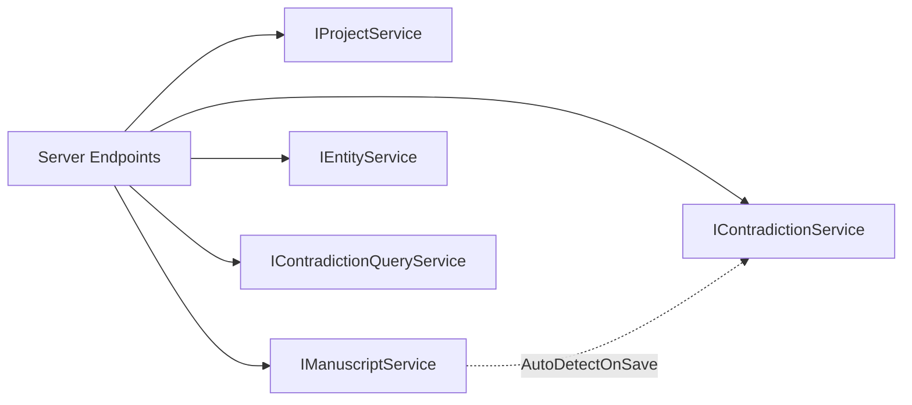

# 02 — 引擎内核

> **立项参考**：[reference/03-数据模型与存储.md](./reference/03-数据模型与存储.md)（字段级愿景）

---

## 一、范围

`WorldForge.Core` 中 **与租户无关** 的共享部分：

- `Entities/` — 持久化共享类型
- `Abstractions/` — 跨场景能力契约
- `Enums/` — 共用枚举
- `Services/` — 服务接口（实现在 Infrastructure）

租户专有实体在 [03-租户引擎](./03-租户引擎.md)。

---

## 二、共享实体（Entities/）

### Note — TPH 根类型

```csharp
public abstract class Note
{
    public Guid Id { get; set; }
    public Guid ProjectId { get; set; }
    public string Title { get; set; }
    public string ContentJson { get; set; }      // TipTap JSON，默认 "{}"
    public float[]? Embedding { get; set; }     // MVP：SQLite JSON 序列化
    public DateTime CreatedAt { get; set; }
    public DateTime UpdatedAt { get; set; }
    public Project Project { get; set; }
    public ICollection<EntityTag> Tags { get; set; }
}
```

### Project

```csharp
public class Project
{
    public Guid Id { get; set; }
    public string Name { get; set; }
    public string TenantTemplateId { get; set; } = "creative";  // 创建时写入
    public string DbFilePath { get; set; }
    public DateTime LastOpenedAt { get; set; }
    public ProjectSettings Settings { get; set; }
}
```

`ProjectSettings`：`DefaultEra`、`AutoDetectOnSave`、`PreferredOllamaModel`（默认 `phi4-mini`）。

### Contradiction

检测产出，租户无关结构：`Type`、`Severity`、`Summary`、章节引用、`RelatedEntityId`、`Status`、`DetectionRunId` 等。

### EntityLink

手稿正文 → 实体的 `@` 引用（offset 范围）。`SourceDocument` 类型为 Creative 的 `ManuscriptDocument`（MVP 仅此链式文档）。

### EntityRelationship

**全租户通用**关系边：

```csharp
public class EntityRelationship : IRelationshipEdge
{
    public Guid ProjectId { get; set; }
    public Guid FromEntityId { get; set; }
    public Guid ToEntityId { get; set; }
    public string RelationType { get; set; }
    public string? Notes { get; set; }
}
```

---

## 三、能力接口（Abstractions/）

| 接口 | 用途 | 典型实现 |
|------|------|---------|
| `IEntityNode` | 图谱节点 `Id` + `DisplayName` | WorldCharacter, DigitalAccount… |
| `ITimelineEntry` | 时间线 `EventDate`、`RelatedEntityIds` | TimelineEvent, LifeEvent… |
| `IAgeAwareEntity` | 年龄推导 | WorldCharacter |
| `IRelationshipEdge` | 关系边 | EntityRelationship |
| `IContradictionRule` | 确定性规则 | AgeTimelineContradictionRule |
| `IContradictionDetectionPlugin` | LLM 检测 | WorldBuildingPlugin |
| `IWorldForgePlugin` | 插件标识 | 同上 |

### 规则上下文

```csharp
public record ContradictionRuleContext(
    Guid ProjectId,
    Guid DetectionRunId,
    IReadOnlyList<Note> Notes,
    IReadOnlyList<EntityLink> Links);
```

### 插件请求

```csharp
public record ContradictionDetectionRequest(
    Guid ProjectId,
    Guid? FocusDocumentId,
    IReadOnlyList<Note> Notes,
    IReadOnlyList<EntityLink> Links);
```

---

## 四、服务接口（Services/）

### 4.1 已实现

| 接口 | 实现 | 方法 |
|------|------|------|
| `IProjectService` | Infrastructure | ListRecent, Get, Create |
| `IContradictionService` | Infrastructure | DetectAsync |
| `IManuscriptService` | Infrastructure | GetTree, CRUD, Reorder ✅ 2026-07-05 |
| `IEntityService` | Infrastructure | CRUD, prefix search ✅ 2026-07-05 |

### 4.2 规划接口（设计草案 · 部分待实现）

与 [07 §七](./07-服务端API.md) API 一一对应；**接口在 Core，实现在 Infrastructure**。

#### INoteQueryService — 通用 Note 读

```csharp
public interface INoteQueryService
{
    Task<Note?> GetAsync(Guid projectId, Guid noteId, CancellationToken ct = default);
    Task<IReadOnlyList<Note>> ListByProjectAsync(
        Guid projectId,
        string? discriminator = null,
        CancellationToken ct = default);
}
```

- `discriminator` 过滤 TPH 子类型（如 `WorldCharacter`）  
- 返回 `Note` 基类；调用方 `OfType<T>()` 或 API 层映射 DTO  

#### IManuscriptService — 手稿树 + 章节 ✅ 已实现

```csharp
public record ManuscriptTreeNode(
    Guid Id, string Title, Guid? ParentId, int SortOrder, int WordCount, DocumentStatus Status);

public record SaveManuscriptRequest(
    string? Title,
    string? ContentJson,
    DocumentStatus? Status,
    IReadOnlyList<EntityLinkInput>? EntityLinks);

public record EntityLinkInput(Guid TargetEntityId, int StartOffset, int EndOffset);

public interface IManuscriptService
{
    Task<IReadOnlyList<ManuscriptTreeNode>> GetTreeAsync(Guid projectId, CancellationToken ct = default);
    Task<ManuscriptDocument?> GetDocumentAsync(Guid projectId, Guid documentId, CancellationToken ct = default);
    Task<IReadOnlyList<EntityLink>> GetLinksAsync(Guid projectId, Guid documentId, CancellationToken ct = default);

    Task<ManuscriptDocument> CreateAsync(
        Guid projectId, string title, Guid? parentId, CancellationToken ct = default);

    Task SaveAsync(Guid projectId, Guid documentId, SaveManuscriptRequest request, CancellationToken ct = default);
    Task DeleteAsync(Guid projectId, Guid documentId, CancellationToken ct = default);

    Task ReorderAsync(
        Guid projectId,
        IReadOnlyList<(Guid Id, Guid? ParentId, int SortOrder)> items,
        CancellationToken ct = default);
}
```

**SaveAsync 职责**：

1. 更新 `ManuscriptDocument` 字段 + `UpdatedAt`  
2. 重算 `WordCount`（TipTap 纯文本）  
3. **全量替换** `EntityLinks`（与 08 §11.3 一致）  
4. 若 `ProjectSettings.AutoDetectOnSave` → 排队 `IContradictionService`（异步，05 §十）  

#### IEntityService — 租户实体 CRUD

```csharp
public record CreateEntityRequest(
    string Discriminator,
    string Title,
    string? ContentJson,
    IReadOnlyDictionary<string, object?>? Fields);

public interface IEntityService
{
    Task<IReadOnlyList<Note>> ListAsync(
        Guid projectId, string discriminator, CancellationToken ct = default);

    Task<Note?> GetAsync(Guid projectId, Guid entityId, CancellationToken ct = default);

    Task<Note> CreateAsync(Guid projectId, CreateEntityRequest request, CancellationToken ct = default);

    Task UpdateAsync(Guid projectId, Guid entityId, CreateEntityRequest request, CancellationToken ct = default);

    Task DeleteAsync(Guid projectId, Guid entityId, CancellationToken ct = default);

    Task<IReadOnlyList<Note>> SearchByPrefixAsync(
        Guid projectId, string prefix, int take = 20, CancellationToken ct = default);
}
```

**租户门控**：`CreateAsync` / `UpdateAsync` 校验 `Discriminator` ∈ `ITenantRegistry.Get(project.TenantTemplateId).EntityTypes`；否则抛 `InvalidOperationException` → API 400。

#### IRelationshipService — EntityRelationship（Phase 1b）

```csharp
public interface IRelationshipService
{
    Task<IReadOnlyList<EntityRelationship>> ListAsync(Guid projectId, CancellationToken ct = default);
    Task UpsertAsync(Guid projectId, EntityRelationship edge, CancellationToken ct = default);
    Task DeleteAsync(Guid projectId, Guid relationshipId, CancellationToken ct = default);
}
```

#### IContradictionQueryService — 矛盾列表（Phase 1b）

```csharp
public interface IContradictionQueryService
{
    Task<IReadOnlyList<Contradiction>> ListAsync(
        Guid projectId,
        ContradictionStatus? status = null,
        ContradictionSeverity? severity = null,
        CancellationToken ct = default);

    Task UpdateStatusAsync(
        Guid projectId, Guid contradictionId, ContradictionStatus status, CancellationToken ct = default);
}
```

与现有 `IContradictionService.DetectAsync` 分离：**检测** vs **查询/状态更新**。

### 4.3 依赖关系



### 4.4 实现约束

| 规则 | 说明 |
|------|------|
| 无 EF 引用 | 接口与 record 均在 Core；DbContext 仅在 Infrastructure |
| 分库就绪 | 方法首参 `projectId`；实现内用 `IProjectDbContextFactory`（04 §9.2） |
| 事务 | `SaveAsync` + EntityLink 替换同一 transaction |
| 测试 | Infrastructure 测集成；Core 测门控逻辑可 Mock `ITenantRegistry` |

---

## 五、枚举（Enums/）

| 枚举 | 用途 |
|------|------|
| `ContradictionType` | AgeMismatch, NameVariant, … |
| `ContradictionSeverity` | Info, Warning, Error |
| `ContradictionStatus` | Open, Acknowledged, Resolved, FalsePositive |
| `DocumentStatus` | Draft, Revised, Final |
| `LocationType` | City, Region, … |
| `SecurityTier` | Standard, Enhanced, E2EE |

---

## 六、DI 入口

`Core/DependencyInjection.cs` → `AddWorldForgeCore()`：

1. `EntityTypeCatalog.RegisterFromTenants(...)`  
2. `ITenantRegistry` / `ITenantContext`  
3. `IContradictionRule` → `AgeTimelineContradictionRule`

---

## 七、相关文档

- [03-租户引擎](./03-租户引擎.md)
- [04-数据持久化](./04-数据持久化.md)

---

*上一篇：[01-系统全景](./01-系统全景与项目结构.md) · 下一篇：[03-租户引擎](./03-租户引擎.md)*
