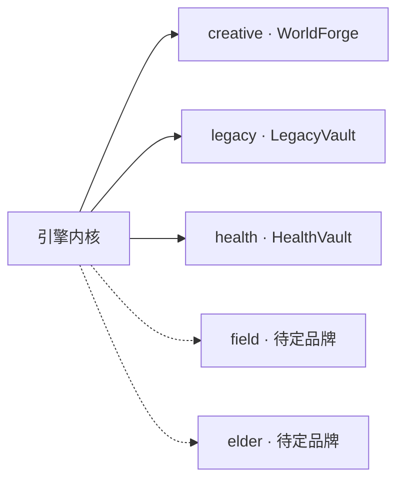

# 03 — 租户引擎

> **立项参考**：[reference/13-复用架构与租户引擎.md](./reference/13-复用架构与租户引擎.md)（五垂直战略）

---

## 一、设计要点

场景差异通过 **`ITenantTemplate` 配置包** 注入，不在业务代码中写 `switch (tenant)`。

```
ITenantTemplate
    ├── EntityTypes[]      → EntityTypeCatalog → EF TPH
    ├── PluginIds[]        → ContradictionService 筛选 AI 插件
    ├── ContradictionRuleIds[] → 筛选 IContradictionRule
    ├── SkinId             → 前端换肤（✅ v2 已接，见 08 §六/§十四）
    ├── SecurityLevel      → 安全策略分级
    └── FeatureFlags       → ContradictionDetection 等开关
```

---

## 二、核心类型

### ITenantTemplate / ITenantRegistry / ITenantContext

| 类型 | 职责 |
|------|------|
| `ITenantTemplate` | 单租户静态配置（`Instance` 单例） |
| `ITenantRegistry` | `Get` / `GetRequired` / `All` |
| `ITenantContext` | 运行时当前租户，默认 `creative` |

项目创建时 `ProjectService` 将 `tenantContext.Current.Id` 写入 `Project.TenantTemplateId`。

检测时 `ContradictionService` 用 **`project.TenantTemplateId`** 解析模板（非仅 Context）。

### EntityTypeCatalog

```csharp
EntityTypeCatalog.RegisterFromTenants(templates);
// → Discriminator[name] = clrType
// DbContext OnModelCreating 遍历注册 TPH
```

当前注册 **12** 个 Note 子类型（3 租户已进代码；Field/Elder 见 §九 设计占位）。

### 字符串 ID 常量

| 类 | 示例 |
|----|------|
| `TenantIds` | Creative, Legacy, Health（Field/Elder 仅 §九 设计规格，代码常量未预埋） |
| `ForgePlugins` | world-building, legacy-compliance, health-symptom-check（field-log / elder-care 同上未预埋） |
| `ForgeRules` | age-timeline |

Core 用字符串关联 AI 插件，**不引用** `WorldForge.AI` 程序集。

---

## 三、已注册租户

### creative（MVP 启用）

| 项 | 值 |
|----|-----|
| 路径 | `Tenants/Creative/` |
| 实体 | WorldCharacter, WorldLocation, WorldFaction, WorldItem, TimelineEvent, ManuscriptDocument |
| 规则 | `ForgeRules.AgeTimeline` |
| 插件 | `ForgePlugins.WorldBuilding` |
| SecurityTier | Standard |
| SkinId | `immersive-dark` |
| 矛盾检测 | ✅ |

### legacy（占位）

| 项 | 值 |
|----|-----|
| 实体 | DigitalAccount, LifeEvent, Letter |
| SecurityTier | E2EE |
| SkinId | `trust-neutral` |
| 矛盾检测 | ❌ |

### health（占位）

| 项 | 值 |
|----|-----|
| 实体 | SymptomRecord, DoctorVisit, HealthNote |
| SecurityTier | Enhanced |
| SkinId | `clinical-light` |
| 矛盾检测 | ❌ |

---

## 四、实体 ↔ 立项映射

| Creative | Legacy | Health |
|----------|--------|--------|
| WorldCharacter | DigitalAccount | SymptomRecord |
| TimelineEvent | LifeEvent | DoctorVisit |
| ManuscriptDocument | Letter | HealthNote |

Legacy/Health 类型 **已进 TPH**（代码）。Field/Elder 见 §九（仅设计，月 24+ 条件启用）。

---

## 五、五垂直全景（立项）



| 租户 Id | 品牌（立项） | 代码注册 | GTM 窗口 |
|---------|-------------|:--------:|---------|
| creative | WorldForge | ✅ | 月 0–12 |
| legacy | LegacyVault | ✅ 占位 | 月 12–18 |
| health | HealthVault | ✅ 占位 | 月 18–24 |
| field | 待定 | ⬜ 设计 | 月 24+ |
| elder | 待定 | ⬜ 设计 | 月 24+ |

**刻意边界**（reference/12）：月 0–12 **仅 creative GTM**；Field/Elder 只预埋 Catalog 设计，不注册 DI、不获取用户。

---

## 六、Field / Elder 占位规格（设计）

与 Legacy/Health 同模式：**Note 子类 + TenantTemplate + Catalog 注册**，无 UI、无 GTM。

### 6.1 field（D 场景 · 现场记录）

| 项 | 设计值 |
|----|--------|
| `TenantIds.Field` | `"field"` |
| DisplayName | FieldLog（工作名待定） |
| SecurityTier | Standard |
| SkinId | `field-high-contrast`（户外高对比） |
| FeatureFlags | ContradictionDetection: false, Collaboration: true（Phase 3） |
| PluginIds | `ForgePlugins.FieldLog` |

**规划实体**（`Tenants/Field/Entities/`）：

| 类型 | 实现接口 | 映射语义 |
|------|---------|---------|
| `SiteRecord` | IEntityNode | 现场/工点/项目点 |
| `FieldEvent` | ITimelineEntry | 巡检、施工节点 |
| `FieldNote` | IEntityNode | 带 TipTap 的现场记录（手稿类比） |

### 6.2 elder（E 场景 · 老年照护）

| 项 | 设计值 |
|----|--------|
| `TenantIds.Elder` | `"elder"` |
| DisplayName | CareCircle（工作名待定） |
| SecurityTier | Enhanced（Level 1，reference/08） |
| SkinId | `elder-large-type`（大字号、高对比） |
| FeatureFlags | ContradictionDetection: false |
| PluginIds | `ForgePlugins.ElderCare`（用药提醒检验 Phase 3） |

**规划实体**（`Tenants/Elder/Entities/`）：

| 类型 | 实现接口 | 映射语义 |
|------|---------|---------|
| `CareProfile` | IEntityNode, IAgeAwareEntity | 被照护者档案 |
| `CareEvent` | ITimelineEntry | 就医、拜访、异常事件 |
| `CareNote` | IEntityNode | 照护日志 |

### 6.3 注册后 Catalog 规模

| 阶段 | 租户数 | Note 子类型约计 |
|------|:------:|:---------------:|
| 当前代码 | 3 | 12 |
| +Field/Elder 占位代码 | 5 | 18 |

Migration：TPH 新增子类若 **仅 discriminator、无新列** → 空 Migration；有新列则 `AddFieldTenantEntities`（见 [04 §8.4](./04-数据持久化.md)）。

### 6.4 启用检查清单（未来）

- [ ] PMF：Creative NPS ≥ 40 且 Legacy 路线确认（reference/09）  
- [ ] 独立品牌与 GTM 渠道就绪  
- [ ] `AddWorldForgeCore()` 注册模板 + 实体文件  
- [ ] 更新 `GET /api/tenants` 与 [12 §二](./12-实现状态总表.md)  

---

## 七、扩展新租户（操作清单）

1. `Tenants/Xxx/Entities/*.cs` 继承 `Note`，按需实现 `IEntityNode` 等  
2. `XxxTenantTemplate.cs` 实现 `ITenantTemplate`  
3. `DependencyInjection.AddWorldForgeCore()` 加入模板实例  
4. （可选）新 Rule / Plugin + DI 注册  
5. 更新 [12-实现状态总表](./12-实现状态总表.md)

**无需改**：`WorldForgeDbContext` 类、`ContradictionService` 主流程。

---

## 八、HTTP 暴露

| 端点 | 说明 |
|------|------|
| `GET /api/tenants` | 摘要列表 |
| `GET /api/tenants/{id}` | 实体类型名、插件、规则、FeatureFlags |

---

## 九、相关文档

- [02-引擎内核](./02-引擎内核.md)
- [04-数据持久化](./04-数据持久化.md)
- [05-矛盾检测编排](./05-矛盾检测编排.md)

---

*上一篇：[02-引擎内核](./02-引擎内核.md) · 下一篇：[04-数据持久化](./04-数据持久化.md)*
