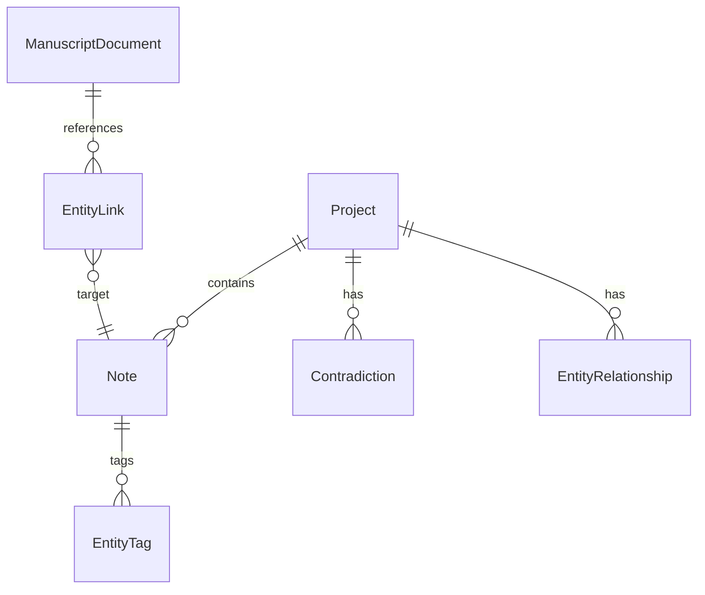

# 04 — 数据持久化

> **立项参考**：[reference/03-数据模型与存储.md](./reference/03-数据模型与存储.md)、[reference/04-离线优先与同步策略.md](./reference/04-离线优先与同步策略.md)

---

## 一、技术选型（当前）

| 项 | 实现 |
|----|------|
| ORM | EF Core 10 |
| MVP 数据库 | SQLite（按项目分库） |
| 注册库 | `Server/Data/_registry.worldforge.db`（仅 Projects 表，`EnsureCreatedAsync`） |
| 项目库 | `Server/Data/Projects/{projectId}.worldforge.db`（创建时 `MigrateAsync`） |
| Design-time | `worldforge.dev.db`（仅 `dotnet ef` 工具链用，见 `WorldForgeDbContextFactory`） |
| 继承 | TPH，`Discriminator` 列 |

> ⚠️ 已知债：注册库走 `EnsureCreated`、项目库走 Migrations，策略不一致 — 见 [13-演进计划 §1.3](./13-演进计划.md)。

PostgreSQL 副本、pgvector、EF `VectorDistance`：**未实现**。

---

## 二、WorldForgeDbContext

路径：`Infrastructure/Persistence/WorldForgeDbContext.cs`

### DbSet

| DbSet | 类型 |
|-------|------|
| Projects | Project |
| Notes | Note（TPH 根） |
| Contradictions | Contradiction |
| EntityLinks | EntityLink |
| EntityRelationships | EntityRelationship |
| EntityTags | EntityTag |

### OnModelCreating 流程

1. `Project` + `OwnsOne(Settings)` + 导航  
2. `ApplyNoteHierarchy()` — Catalog 动态 discriminator  
3. `ApplyTenantSpecificProperties()` — JSON 列转换  
4. `ManuscriptDocument` ↔ `EntityLink`  
5. `EntityRelationship` 外键  

---

## 三、EntityModelExtensions

`ApplyNoteHierarchy`：

```csharp
EntityTypeCatalog.EnsureInitialized();
var discriminator = modelBuilder.Entity<Note>().HasDiscriminator<string>("Discriminator");
foreach (var (name, clrType) in EntityTypeCatalog.All)
    discriminator.HasValue(clrType, name);
```

`ApplyTenantSpecificProperties`：

| 实体 | 转换 |
|------|------|
| WorldCharacter.Aliases | `List<string>` ↔ JSON |
| TimelineEvent.RelatedEntityIds | `List<Guid>` ↔ JSON |
| LifeEvent.RelatedEntityIds | 同上 |
| DoctorVisit.RelatedEntityIds | 同上 |
| Note.Embedding | `float[]?` ↔ JSON |

> ponytail: MVP SQLite 用 JSON 存向量；Phase 2 可换 pgvector + HNSW。

---

## 四、ER（实际表意）



Note 子类型（12 种）在单表 TPH 中，不单独展开。

---

## 五、Infrastructure 服务

### ProjectService

- `CreateAsync`：生成 Id、写入 `TenantTemplateId`、设置 `DbFilePath`  
- `ListRecentAsync`：最近 20 条  

### ContradictionService

见 [05-矛盾检测编排](./05-矛盾检测编排.md)。

### DependencyInjection

```csharp
services.AddDbContext<WorldForgeDbContext>(o => o.UseSqlite(connectionString));
services.AddScoped<IProjectService, ProjectService>();
services.AddScoped<IContradictionService, ContradictionService>();
```

---

## 六、与「客户端权威」的差距

| 立项目标 | 当前骨架 |
|---------|---------|
| 每项目独立 `.worldforge.db` 文件 | 单开发库，Project 仅元数据行 |
| PWA 内 SQLite / Electron | Server 侧 EF |
| 增量云备份 | 无 |

Phase 1 可接受：**API 即本地数据网关**；后续把 DbContext 移到客户端宿主或双端同步。

---

## 七、待办追踪

| 项 | 设计 | 代码 |
|----|:----:|:----:|
| EF Migrations | ✅ §八 | ✅ 2026-07-05 |
| 按项目分库 | ✅ §九 | ✅ 2026-07-05 |
| Embedding 管线 | 06 §十 | ⬜ |
| Security Level 0 | ✅ §十 + 08 §十六 | 🔶 规范 |

---

## 八、EF Migrations 规格

### 8.1 为何替换 EnsureCreated

| EnsureCreated | Migrations |
|---------------|------------|
| 无版本历史 | 可审查 schema 变更 |
| 模型变更可能丢数据 | 可写 Up/Down |
| CI 难以复现 | `dotnet ef database update` 可脚本化 |

**目标**：月 1 第 1 周结束前切换；见 [11-部署与开发环境](./11-部署与开发环境.md) §四。

### 8.2 工具链

```bash
# 设计时（Infrastructure 为启动项目）
dotnet ef migrations add InitialCreate \
  --project src/WorldForge.Infrastructure \
  --startup-project src/WorldForge.Server \
  --output-dir Persistence/Migrations

dotnet ef database update \
  --project src/WorldForge.Infrastructure \
  --startup-project src/WorldForge.Server
```

| 配置项 | 值 |
|--------|-----|
| Design-time factory | `IDesignTimeDbContextFactory<WorldForgeDbContext>` 于 Infrastructure |
| 开发连接串 | 与 `Program.cs` 相同 `Data/worldforge.dev.db` |
| 包 | `Microsoft.EntityFrameworkCore.Design`（已引用） |

### 8.3 初始 Migration 范围

单 Migration 包含：

- `Projects` + owned `ProjectSettings`  
- `Notes` TPH（12 discriminator 值，由 Catalog 生成模型快照）  
- `Contradictions`、`EntityLinks`、`EntityRelationships`、`EntityTags`  
- 索引建议：`Notes(ProjectId)`、`Contradictions(ProjectId, Status)`、`EntityLinks(SourceDocumentId)`  

### 8.4 新增租户实体时的 Migration 策略

1. 在 `Tenants/Xxx/Entities` 增加 `Note` 子类  
2. 注册 `XxxTenantTemplate` → Catalog  
3. 新 Migration：`AddFieldTenantEntities`（仅增 discriminator 列组合，**不新表**）  
4. 更新 [03-租户引擎](./03-租户引擎.md) 与 [12 §七](./12-实现状态总表.md)  

TPH 下新增子类型通常 **不改表结构**（仅新 Discriminator 值）；若子类有新列，Migration 会 `AddColumn`。

### 8.5 CI 集成（设计）

```yaml
# reference/11 — 待写入 11 §五
- run: dotnet ef database update --no-build
- run: dotnet test
```

---

## 九、按项目分库规格

### 9.1 目标形态

```
~/WorldForge/Projects/
├── MyNovel.worldforge.db          ← Project.DbFilePath
├── AnotherSaga.worldforge.db
└── _registry.worldforge.db        ← 可选：仅 Project 元数据索引（Phase 1b）
```

立项目标：**一项目一 SQLite 文件**（reference/03 §四）。当前开发期仍可用单库；分库与 Migrations **可同 Sprint 落地**。

### 9.2 连接串解析

```csharp
// 设计：IProjectDbContextFactory
public interface IProjectDbContextFactory
{
    WorldForgeDbContext CreateForProject(Project project);
}
```

| 模式 | ConnectionString |
|------|------------------|
| 开发单库 | `Data Source=Data/worldforge.dev.db` |
| 分库 | `Data Source={ProjectsRoot}/{project.DbFilePath}` |

`ProjectsRoot`：用户文档目录 `WorldForge/Projects`（可配置 `appsettings.ProjectsRoot`）。

### 9.3 Project 生命周期

| 步骤 | 行为 |
|------|------|
| Create | 生成 `{SanitizedName}.worldforge.db`，`EnsureCreated` 或 `Migrate` 空库 |
| Open | `ProjectService` 解析路径，工厂创建 scoped DbContext |
| Delete | 删 registry 行 + 可选删文件 |

**MVP 简化**：registry 与项目数据 **同一库** 亦可；分库时 registry 存 `_registry` 或主库仅 Projects 表。

### 9.4 API 层影响

- Endpoints 注入 `IProjectDbContextFactory` 而非单例 `WorldForgeDbContext`  
- 所有 `/api/projects/{projectId}/...` 先校验 Project 存在再打开对应库  

### 9.5 与离线/PWA 路径

长期（reference/04）：DbContext 跑在 **客户端宿主**；`DbFilePath` 指向 File System Access API 或 Electron 路径。Server 分库设计 **与客户端路径字段兼容**，避免二次迁移。

---

## 十、Security Level 0 与存储层

> 立项全文：[reference/08-安全与隐私.md](./reference/08-安全与隐私.md)。Creative MVP = **Level 0（Standard）**。

### 10.1 等级与租户

| SecurityTier（03） | 场景 | 存储要求 |
|-------------------|------|---------|
| Standard | creative, field（设计） | 本文 §十 |
| Enhanced | health | + 访问审计 Phase 2 |
| E2EE | legacy | ML-KEM + 客户端加密 Phase 3 |

当前代码：`CreativeTenantTemplate.SecurityLevel = Standard`。

### 10.2 数据驻留（实际 vs 目标）

| 数据 | 立项目标 | 当前骨架 | 差距 |
|------|---------|---------|------|
| 手稿/实体 | SQLite 本地，默认不上云 | Server `Data/*.db` | 开发期集中库；分库后对齐 |
| Embedding | 本地 | JSON 列同库 | ✅ |
| 矛盾记录 | 本地 | 同库 | ✅ |
| 云备份 | Phase 2 ciphertext | 无 | — |

**营销承诺**（reference/08 §2.1）在 PWA/Electron 落地前，文档表述为「设计目标」；Server 开发模式不构成产品终态。

### 10.3 存储层技术控制

| 控制项 | 设计 | 代码 |
|--------|------|:----:|
| SQL 注入 | EF Core 参数化；禁止 FromSqlRaw 拼接用户输入 | ✅ |
| 文件权限 | `.worldforge.db` 仅当前 OS 用户可读（分库后） | ⬜ |
| 日志脱敏 | 不记录 ContentJson / Embedding 全文 | ⬜ 规范 |
| 删除项目 | DELETE project + 可选删 db 文件 | ⬜ API |
| 导出 | Markdown/JSON 导出供用户携转（reference/08 §8） | ⬜ |

### 10.4 传输与 API（与 07 衔接）

| 路径 | Level 0 要求 | 当前 |
|------|-------------|------|
| 本地 dev | HTTP localhost | ✅ 5280/5173 |
| 生产 API | TLS 1.3 | ⬜ |
| 许可证验证 | HTTPS + 签名校验 | 🔶 占位 |
| 速率限制 | 60 req/min API | ⬜ |

### 10.5 升级至 E2EE 预埋（不改 MVP schema）

reference/08 §四 密钥流与 **Project/Data Key** 概念兼容：

- 云备份 Phase 2：`ProjectBackups` 存 **AES-GCM ciphertext blob**，服务端无 Master Key  
- Legacy 租户启用时：可选 `ProjectSettings` 扩展 `EncryptionEnabled`（Phase 3）  
- **Creative MVP 不启用 E2EE**，避免营销「后量子」误导（reference/08 §五）

### 10.6 与 08 前端分工

| 威胁 | 存储层（本文） | 前端（08 §十六） |
|------|---------------|-----------------|
| XSS 窃取 localStorage | N/A（数据在 SQLite） | TipTap sanitize、CSP |
| 恶意导入 | 解析在 Server/Infrastructure | 文件大小 UI 限制 |
| CSRF | JWT/API 无 cookie 时风险低 | SameSite 若引入 cookie |

---

## 十一、相关文档

- [03-租户引擎](./03-租户引擎.md)
- [07-服务端 API](./07-服务端API.md) §七
- [08-前端 ClientApp](./08-前端ClientApp.md) §十六
- [09-离线存储与同步](./09-离线存储与同步.md)
- [reference/08-安全与隐私.md](./reference/08-安全与隐私.md)

---

*上一篇：[03-租户引擎](./03-租户引擎.md) · 下一篇：[05-矛盾检测编排](./05-矛盾检测编排.md)*
