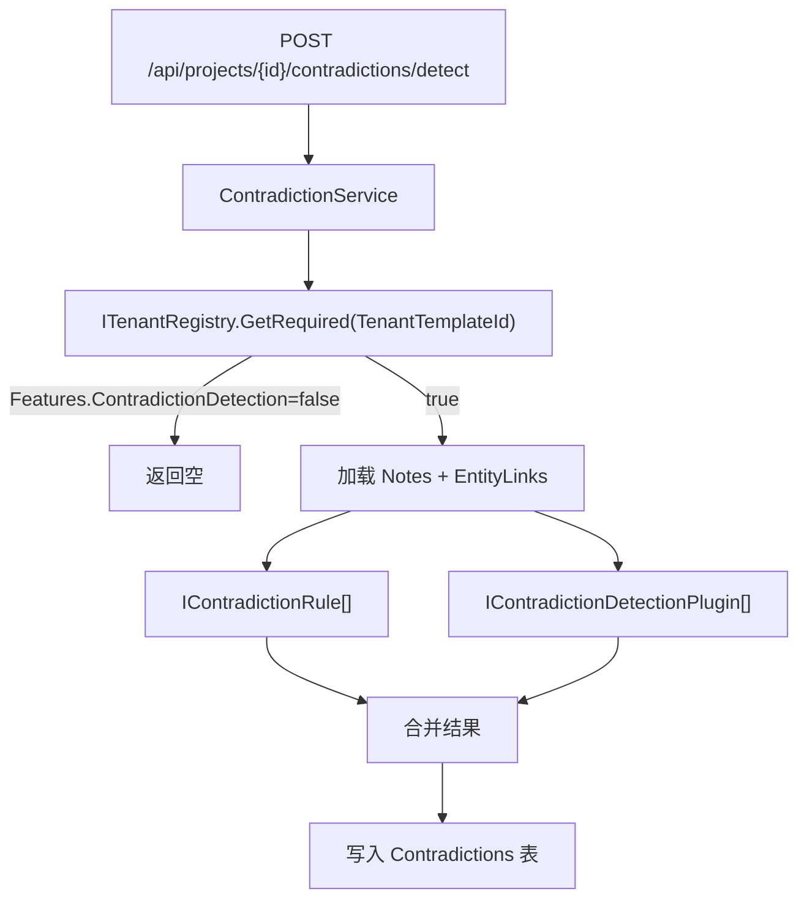

# 05 — 矛盾检测编排

> **立项参考**：[reference/05-AI矛盾检测管线.md](./reference/05-AI矛盾检测管线.md)（Ollama、2s SLA、全书扫描）

---

## 一、实际流程



入口：`Infrastructure/Services/ContradictionService.cs`  
触发：HTTP POST 手动检测；`ProjectSettings.AutoDetectOnSave = true` 时手稿保存后异步触发（`ManuscriptService.SaveAsync` fire-and-forget）。全书扫描队列仍无。

---

## 二、租户门控

```csharp
var tenant = tenantRegistry.GetRequired(project.TenantTemplateId);
if (!tenant.Features.ContradictionDetection)
    return [];
```

| 租户 | 检测 |
|------|:----:|
| creative | ✅ |
| legacy / health | ❌ 直接返回空 |

---

## 三、规则轨（已实现）

### AgeTimelineContradictionRule

- **RuleId**：`ForgeRules.AgeTimeline`  
- **租户**：creative  
- **逻辑**：`WorldCharacter` 的 `BirthDate` + `Age` 与 `TimelineEvent.EventDate` 交叉验证  
- **无 LLM**，确定性输出  

注册：`AddWorldForgeCore()` → `AddSingleton<IContradictionRule, AgeTimelineContradictionRule>()`  

筛选：`tenant.ContradictionRuleIds` 与 `rule.RuleId` + `SupportedTenantIds` 匹配。

---

## 四、插件轨（已实现 · Ollama）

### WorldBuildingPlugin

- **PluginId**：`ForgePlugins.WorldBuilding`  
- **接口**：`IContradictionDetectionPlugin`  
- **当前行为**：组装实体卡片/时间线/章节摘录 prompt → `IChatClient`（Ollama `/api/chat`，模型取 `ProjectSettings.PreferredOllamaModel`）→ 解析 JSON findings  
- **降级**：Ollama 不可用/超时/解析失败 → 返回空列表，仅规则轨生效  

注册：`AddWorldForgeAi()` 注册 `OllamaChatClient` + 同一插件实例为 Plugin + WorldForgePlugin（见 [06](./06-AI插件层.md)）。

---

## 五、Contradiction 持久化

检测完成后 `db.Contradictions.AddRange(found)` 一次 SaveChanges。

`MapFinding` 将插件返回的 `ContradictionFinding` 转为 `Contradiction` 实体（枚举字符串解析）。

---

## 六、与立项目标的差距

| 立项 | 当前 |
|------|------|
| 保存时可选自动检测 | ✅ AutoDetectOnSave |
| 全书扫描队列 | ❌ |
| 单章 P95 < 2s | 未测 |
| 规则：别名、时间线顺序 | ❌ 仅年龄 |
| LLM JSON 输出 | ✅ prompt 内嵌 schema + `format: json`（无独立 `.schema.json` 文件） |
| 冲突面板 UI | ✅ 列表 + status 过滤 + Acknowledge（跳转/Split 未做） |
| 重跑去重 | ❌ 每次检测追加新记录（v3 计划项） |

---

## 七、扩展方式

**新规则**（Core）：

```csharp
public sealed class MyRule : IContradictionRule {
    public string RuleId => "my-rule";
    public IReadOnlyList<string> SupportedTenantIds => ["creative"];
    public IEnumerable<Contradiction> Evaluate(ContradictionRuleContext ctx) { ... }
}
// DI: services.AddSingleton<IContradictionRule, MyRule>();
// 模板: ContradictionRuleIds 加入 "my-rule"
```

**新插件**（AI）：实现 `IContradictionDetectionPlugin`，DI 注册，模板 `PluginIds` 引用。

---

## 八、相关文档

- [06-AI 插件层](./06-AI插件层.md)
- [reference/05-AI矛盾检测管线.md](./reference/05-AI矛盾检测管线.md)

---

## 九、规则轨路线图（设计）

| RuleId | 类名（规划） | 检测内容 | 阶段 |
|--------|-------------|---------|:----:|
| `age-timeline` | AgeTimelineContradictionRule | 年龄 vs 时间线 | ✅ |
| `alias-consistency` | AliasConsistencyRule | 未声明别名变体 | 月 3 |
| `timeline-order` | TimelineOrderRule | 事件顺序与正文 | 月 3 |
| `death-status` | DeathStatusRule | 死亡后仍活动 | 月 3 |

均实现 `IContradictionRule`，注册后写入 `CreativeTenantTemplate.ContradictionRuleIds`。

---

## 十、触发模式（设计）

| 模式 | 入口 | 阶段 | 说明 |
|------|------|:----:|------|
| 手动 | `POST .../detect` | ✅ | 当前唯一 |
| 保存时 | `ProjectSettings.AutoDetectOnSave` | ✅ | PUT 手稿后 fire-and-forget |
| 全书队列 | `POST .../detect?scope=book` | 月 3 | 后台分批，SignalR/轮询进度 Phase 1b |
| 实时 @提示 | 编辑器 entityMention 插入 | Phase 2 | 轻量规则 only |

保存时检测 **不得阻塞** PUT 响应；异步 Task + 前端 ContradictionPanel 轮询或 WebSocket。

---

*上一篇：[04-数据持久化](./04-数据持久化.md) · 下一篇：[06-AI 插件层](./06-AI插件层.md)*
