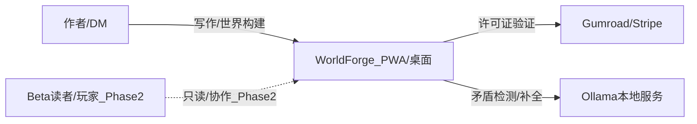
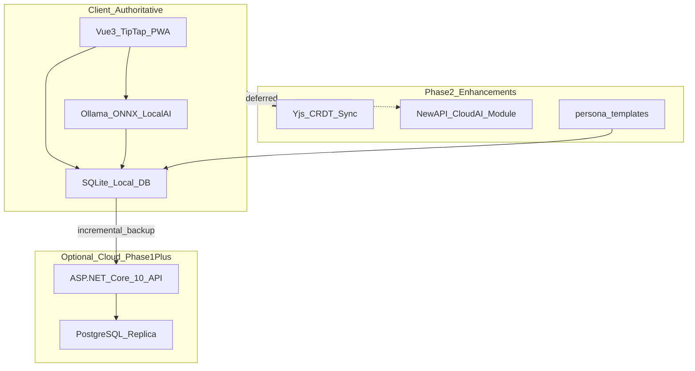
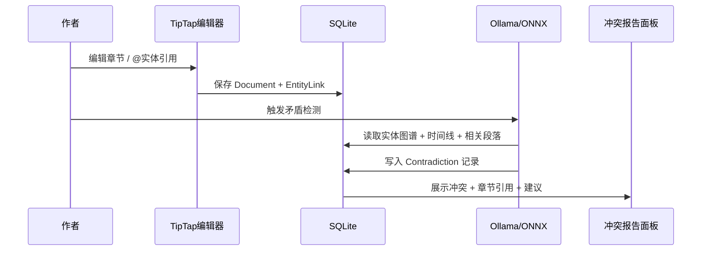

# 01 — 架构总览

> **关联源文档**：`0705调研报告/AI笔记垂直场景/A-创意工作者工作室.md`、`ai笔记调研项目图景/补充场景-核心共性与技术架构复用.md`、`0705调研报告/01-总体项目选型筛选报告.md`

---

## 一、产品上下文

### 1.1 要解决的问题

长篇小说作者、TTRPG 地下城主（DM）、世界观构建者目前在 **5 款工具间切换**（Scrivener、World Anvil、Notion/Obsidian、ChatGPT、Google Docs），导致：

1. 工具零集成 — 角色设定、正文、时间线分散
2. 长篇连续性噩梦 — 章节间年龄、外貌、事件矛盾无人检测
3. 通用 AI 无领域上下文 — 不懂用户自定义世界观规则
4. 订阅疲劳 — TTRPG 用户偏好买断（Ishvana $99、PlotForge $69）

### 1.2 架构目标

构建 **离线优先、客户端权威、本地 AI 驱动** 的一体化创作工作室，在 3–4 个月内可交付 MVP，12 个月内抢占 Ishvana/PlotForge 发布前的竞争窗口。

---

## 二、C4 级系统全景

### 2.1 上下文图（Context）



**外部系统**：
- **Ollama**：用户本机 LLM 运行时（非 WorldForge 托管）
- **可选云 API**（Phase 2）：账户、加密备份、云增强 AI 模块
- **Gumroad**：MVP 阶段买断支付（内置付费延后）

### 2.2 容器图（Containers）



### 2.3 核心数据流（写作 + 矛盾检测）



---

## 三、设计原则

| # | 原则 | 含义 | 违反后果 |
|---|------|------|---------|
| 1 | **SQLite 权威** | 本地库是真相源；PostgreSQL 是可选副本，非缓存 | 离线时报错或丢数据 |
| 2 | **MVP 零网络依赖** | 无网可完整写作 + 本地矛盾检测 | 沦为 World Anvil 式纯 Web |
| 3 | **AI 辅助非代写** | 矛盾检测、补全、语义搜索；不做整章生成 | 版权争议 + 与竞品同质化 |
| 4 | **PWA 先于 MAUI** | 月 0–12 Web/PWA 承担 80% 迭代 | MAUI 工具链拖死 3 个月 MVP |
| 5 | **单场景聚焦** | 月 0–12 只做 Creative 租户；引擎可复用，GTM 不并行 | 五场景 scope creep |
| 6 | **结构化 + 非结构化同库** | 实体字段与手稿正文关联存储，非 Wiki/写作割裂 | 重复 World Anvil + Scrivener 痛点 |

---

## 四、与「一引擎五垂直」的关系

源文档提出 .NET 10 统一引擎服务五个垂直场景（创意 / 遗产 / 健康 / 现场 / 老年）。WorldForge 的定位：

```
┌─────────────────────────────────────────────────────────┐
│              .NET 10 统一核心引擎（长期）                  │
│  SQLite · TipTap · 实体图谱 · Ollama · E2EE · QuestPDF   │
└───────────────────────────┬─────────────────────────────┘
                            │ 月 0–12 仅加载
                            ▼
              ┌─────────────────────────┐
              │  Creative 租户模板       │  ← WorldForge MVP
              │  Character/Location/…   │
              │  WorldBuildingPlugin    │
              └─────────────────────────┘
                            │ PMF 后
                            ▼
              ┌─────────────────────────┐
              │  DeathTech 租户模板      │  ← LegacyVault（月 12–18）
              │  ML-KEM E2EE            │
              └─────────────────────────┘
```

**战略一句话**（来自 01 总体筛选报告）：6 个月做出 $69 买断的创意工具验证 PMF，同一底座 18 个月内递进至遗产与健康。

**GTM 不可复用**：Reddit 创作者社区 ≠ Death Tech 用户；各场景独立品牌（WorldForge → LegacyVault），共享引擎代码。

---

## 五、技术栈总览

| 层级 | 选型 | MVP | Phase 2+ |
|------|------|:---:|:--------:|
| 后端 | ASP.NET Core 10 + PostgreSQL | 账户/备份 | 完整云同步 |
| 前端 | Vue3 + TipTap PWA | ✅ | Electron 备选 |
| 本地存储 | SQLite（客户端权威） | ✅ | 多设备 CRDT |
| AI | Ollama + ONNX Runtime | ✅ 矛盾检测 | 云增强模块 |
| 向量搜索 | EF Core `VectorDistance` | ✅ | — |
| 同步 | Yjs CRDT + SignalR | — | ✅ |
| 导出 | QuestPDF / EPUB | Markdown | PDF/EPUB |
| 桌面壳 | PWA 优先 | ✅ | Electron / MAUI 月 12+ |
| 加密 | 标准 TLS + 本地默认不出设备 | ✅ | E2EE（B 场景） |

---

## 六、差异化架构能力

相对竞品（Scrivener / World Anvil / PlotForge / Ishvana）的 **架构级** 差异：

| 能力 | WorldForge | 竞品现状 |
|------|-----------|---------|
| 离线 + 世界构建 + 写作同库 | ✅ SQLite 统一 | World Anvil 纯 Web；Scrivener 无世界构建 |
| 本地 AI 矛盾检测 | ✅ Ollama/ONNX | 仅 PlotForge/Ishvana 部分支持 |
| LINQ 级向量语义搜索 | ✅ EF Core 10 | 无竞品内置 |
| 引擎向遗产/健康延伸 | ✅ 租户模板 | 单点产品无复用路径 |
| 一次性买断 + 本地数据 | ✅ Markdown/SQLite | World Anvil 订阅 |

---

## 七、相关文档

- 模块拆分：[02-系统分层与模块](./02-系统分层与模块.md)
- 复用引擎：[13-复用架构与租户引擎](./13-复用架构与租户引擎.md)
- 领域模型：[03-数据模型与存储](./03-数据模型与存储.md)
- MVP 边界：[09-MVP范围与路线图](./09-MVP范围与路线图.md)
- 风险红线：[12-风险与刻意边界](./12-风险与刻意边界.md)

---

*上一篇：[00-阅读指南](./00-阅读指南.md) · 下一篇：[02-系统分层与模块](./02-系统分层与模块.md)*
