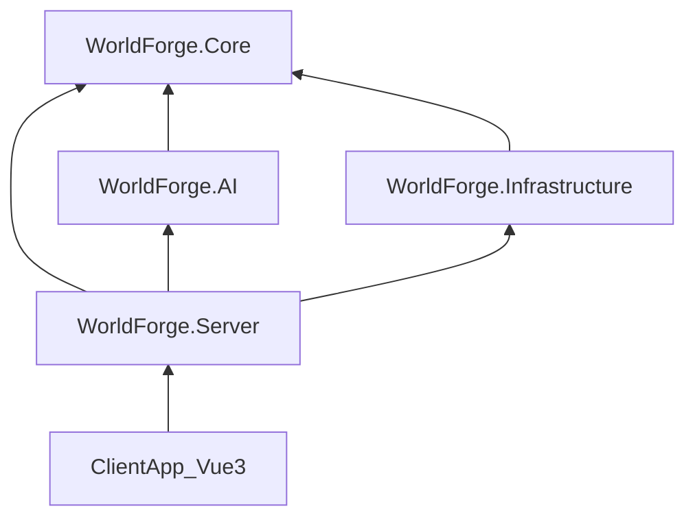

# 02 — 系统分层与模块

> **关联源文档**：`ai笔记调研项目图景/补充场景-核心共性与技术架构复用.md`、`ai笔记调研项目图景/基础信息/深度补充报告-NET10与应用场景.md`、`0705调研报告/02-深度分析-可行性技术利润.md`

---

## 一、逻辑分层

```
┌─────────────────────────────────────────────────────────────────┐
│  Layer 5 · 表现层 (Presentation)                                 │
│  Vue3 + TipTap PWA │ 实体图谱视图 │ 时间线 │ 冲突面板 │ 手稿树    │
├─────────────────────────────────────────────────────────────────┤
│  Layer 4 · 应用层 (Application)                                  │
│  项目管理 │ 导入导出 │ 许可证 │ Creative 租户配置 │ 事件总线       │
├─────────────────────────────────────────────────────────────────┤
│  Layer 3 · AI 层 (Intelligence)                                  │
│  WorldBuildingPlugin │ Ollama/ONNX 客户端 │ Embedding │ 任务队列   │
├─────────────────────────────────────────────────────────────────┤
│  Layer 2 · 数据层 (Data)                                         │
│  EF Core 10 │ SQLite 权威 │ PostgreSQL 副本 │ VectorDistance      │
├─────────────────────────────────────────────────────────────────┤
│  Layer 1 · 基础设施 (Infrastructure)                             │
│  认证 JWT/Passkey │ 文件存储 │ 日志 │ CI/CD │ 可选 SignalR       │
└─────────────────────────────────────────────────────────────────┘
```

---

## 二、模块启用时间表（Creative 场景）

| 模块 | MVP | Phase 2 | Phase 3+ | 复用于 B/C/D/E |
|------|:---:|:-------:|:--------:|:--------------:|
| SQLite 离线引擎 | ✅ | ✅ | ✅ | ✅ 全场景 |
| TipTap 编辑器 | ✅ | ✅ | ✅ | ✅ 信件/清单/笔记 |
| 实体图谱 | ✅ | ✅ | ✅ | ✅ 账户/症状/项目 |
| Ollama 本地 AI | ✅ | ✅ | ✅ | ✅ 全场景 AI 基建 |
| EF Core VectorDistance | ✅ | ✅ | ✅ | ✅ |
| Yjs CRDT 同步 | — | ✅ | ✅ | ✅ 协作 |
| E2EE / ML-KEM | — | — | ✅ | ✅ B 遗产 / C 健康 |
| QuestPDF / EPUB | 部分 | ✅ | ✅ | ✅ 报告导出 |
| MAUI 原生 | — | — | 月 12+ | ✅ HealthKit/GPS |
| Dead Man's Switch | — | — | — | ✅ B 专属 |
| 多人协作 | — | ✅ | ✅ | ✅ |

---

## 三、Creative 租户模板

引擎通过 **租户模板** 注入场景差异，避免分支代码。MVP 仅实例化 `creative` 模板：

```csharp
public record TenantTemplate
{
    public string Id { get; init; } = "creative";
    public string DisplayName { get; init; } = "WorldForge";
    public SecurityTier SecurityLevel { get; init; } = SecurityTier.Standard;
    public Type[] EntityTypes { get; init; } = [
        typeof(WorldCharacter),
        typeof(WorldLocation),
        typeof(WorldFaction),
        typeof(WorldItem),
        typeof(TimelineEvent),
        typeof(ManuscriptDocument)
    ];
    public Type[] PluginTypes { get; init; } = [
        typeof(WorldBuildingPlugin)
    ];
    public UISkinConfig SkinConfig { get; init; } = UISkinConfig.ImmersiveDark;
    public FeatureFlags Features { get; init; } = new(
        ContradictionDetection: true,
        Collaboration: false,
        CloudSync: false
    );
}
```

**UI 皮肤（Creative 模式）**：

| 变量 | 值 | 说明 |
|------|-----|------|
| `--font-size-base` | 16sp | 长文阅读舒适 |
| `--color-primary` | 靛蓝 | 沉浸式深色优先 |
| `--border-radius` | 4px | 偏写作工具感 |
| 模式 | 沉浸深色 | 减少写作干扰 |

---

## 四、项目脚手架

```
WorldForge/
├── global.json
├── WorldForge.sln
├── docs/
│   ├── README.md
│   └── design/                         # 设计文档集
├── src/
│   ├── WorldForge.Server/
│   │   ├── ClientApp/                  # Vue3 (Vite) PWA
│   │   ├── Endpoints/
│   │   └── Program.cs
│   ├── WorldForge.Core/
│   │   ├── Abstractions/               # IEntityNode、IContradictionRule…
│   │   ├── Entities/                   # 共享内核 Note、Project…
│   │   ├── Tenants/                    # Creative / Legacy / Health
│   │   ├── Rules/
│   │   ├── Services/
│   │   └── DependencyInjection.cs
│   ├── WorldForge.Infrastructure/
│   │   ├── Persistence/                # DbContext、EntityTypeCatalog 集成
│   │   └── Services/
│   ├── WorldForge.AI/
│   │   └── Plugins/
│   └── WorldForge.Shared/
├── tests/
│   ├── WorldForge.Core.Tests/
│   └── WorldForge.AI.Tests/
```

### 4.1 项目职责边界

| 项目 | 职责 | 禁止放入 |
|------|------|---------|
| `WorldForge.Core` | 实体、值对象、领域服务、Contradiction 规则 | HTTP、EF DbContext |
| `WorldForge.Infrastructure` | DbContext、Repository、Migration、向量索引 | UI、Ollama 调用 |
| `WorldForge.AI` | LLM 调用、Prompt、Embedding、Plugin | 直接写 UI 状态 |
| `WorldForge.Server` | API、认证、Webhook、SpaProxy | 复杂领域逻辑 |
| `ClientApp` | Vue 组件、TipTap 扩展、PWA | 业务规则硬编码 |

### 4.2 开发启动命令

```bash
# 后端 API（http://localhost:5280）
dotnet watch run --project src/WorldForge.Server

# 前端（另开终端，http://localhost:5173，/api 代理到后端）
cd src/WorldForge.Server/ClientApp && npm run dev

# 测试
dotnet test
```

---

## 五、模块依赖关系



**关键约束**：
- `WorldForge.AI` 依赖 `Core` 的领域接口，不依赖 `Infrastructure` 具体实现（便于单测 Mock）
- 客户端 SQLite 访问：MVP 通过 **本地 API 层**（Electron/PWA 内嵌轻量运行时）或 **WASM SQLite**；Phase 2 统一为原生壳内 SQLite

---

## 六、表现层模块清单

| 模块 | 功能 | MVP |
|------|------|:---:|
| `ManuscriptTree` | 章节树、拖拽排序 | ✅ |
| `TipTapEditor` | 富文本/Markdown、`@Entity` 链接 | ✅ |
| `EntityPanel` | 角色/地点/派系卡片编辑 | ✅ |
| `EntityGraph` | 关系图谱可视化 | ✅ 列表/简图 |
| `TimelineView` | 时间线事件 | ✅ 基础 |
| `ContradictionPanel` | AI 冲突列表 + 跳转章节 | ✅ |
| `SemanticSearch` | 向量语义搜索 | ✅ |
| `ImportWizard` | Scrivener / Markdown 导入 | ✅ |
| `ExportDialog` | Markdown 导出 | ✅ |
| `SplitEditor` | 分屏：手稿 + 实体 | ✅ |
| `DMScreen` | DM 跑团屏（先攻/迷雾） | — |
| `CollaborationCursors` | 多人光标 | — |

---

## 七、应用层模块清单

| 模块 | 功能 | MVP |
|------|------|:---:|
| `ProjectService` | 创建/打开/关闭项目（= SQLite 文件） | ✅ |
| `EntityService` | CRUD + 关系边 | ✅ |
| `DocumentService` | 章节 CRUD + 链接解析 | ✅ |
| `TimelineService` | 事件与实体关联 | ✅ |
| `ContradictionService` | 触发检测、标记已解决 | ✅ |
| `ImportService` | Scrivener `.scriv`、Markdown | ✅ |
| `ExportService` | Markdown；EPUB Phase 2 | 部分 |
| `LicenseService` | Gumroad 许可证验证 | ✅ 简易 |
| `BackupService` | 可选云备份 blob | — |
| `SyncService` | Yjs CRDT | — |

---

## 八、AI 层模块清单

| 模块 | 功能 | MVP |
|------|------|:---:|
| `OllamaChatClient` | `IChatClient` 实现 | ✅ |
| `OnnxEmbeddingGenerator` | 本地 Embedding（可选） | ✅ |
| `WorldBuildingPlugin` | `DetectContradiction` 等 | ✅ |
| `EntityAutocomplete` | 名称补全（字符串 + 向量） | ✅ |
| `AiTaskQueue` | 全书扫描离线排队 | ✅ 简易 |
| `CloudAiModule` | NewAPI 云增强 | — |

详见 [05-AI矛盾检测管线](./05-AI矛盾检测管线.md)。

---

## 九、与后续场景的模块复用

详见专篇 **[13-复用架构与租户引擎](./13-复用架构与租户引擎.md)** 与 **[14-代码库映射与实现状态](./14-代码库映射与实现状态.md)**。

| 本方案沉淀模块 | 复用于 | 改造量 |
|---------------|--------|:------:|
| SQLite + TPH + EntityTypeCatalog | B/C/D/E 全场景 | 低 |
| ITenantTemplate 租户包 | 全场景 | 低 |
| 实体图谱框架 | B 账户、C 症状图 | 中（换 EntityTypes） |
| 矛盾检测编排（规则+插件） | 全场景 AI 基建 | 低 |
| TipTap 编辑器 | B 信件、C 笔记 | 低 |
| E2EE（Phase 2 加） | B 遗产、C 健康 | 中 |
| QuestPDF 管线 | 各场景报告导出 | 中（换模板） |

---

## 十、相关文档

- [03-数据模型与存储](./03-数据模型与存储.md)
- [05-AI矛盾检测管线](./05-AI矛盾检测管线.md)
- [11-部署运维与性能](./11-部署运维与性能.md)

---

*上一篇：[01-架构总览](./01-架构总览.md) · 下一篇：[03-数据模型与存储](./03-数据模型与存储.md)*
