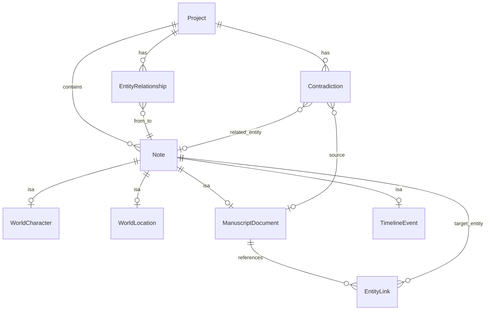

# 03 — 数据模型与存储

> **关联源文档**：`0705调研报告/AI笔记垂直场景/A-创意工作者工作室.md`、`ai笔记调研项目图景/补充场景-核心共性与技术架构复用.md`、`ai笔记调研项目图景/细分场景/场景6-创意工作者-深度调研.md`

---

## 一、存储架构原则

### 1.1 客户端权威（Offline-First）

```
┌──────────────────┐         ┌──────────────────┐
│  SQLite (本地)    │  真相源  │  PostgreSQL (云)  │  副本
│  · 所有读写优先   │ ──────► │  · 账户元数据     │
│  · 离线完全可用   │  增量备份 │  · 加密备份 blob  │
└──────────────────┘         └──────────────────┘
```

**禁止**：云端为空时本地显示空列表；本地写入仅缓存、重启丢失。

### 1.2 结构化 + 非结构化同库

创意场景的典型记录：

> `@暗影领主` 的结构化属性卡片 + 三万字正文章节 + 五条创作笔记 — **三者相互关联、同一数据库**。

避免 World Anvil（Wiki）与 Scrivener（手稿）割裂的重演。

---

## 二、继承策略：TPH（Table Per Hierarchy）

所有内容类型继承抽象基类 `Note`，共享 ID、标题、内容、向量、时间戳：

```csharp
public abstract class Note
{
    public Guid Id { get; set; }
    public Guid ProjectId { get; set; }
    public string Title { get; set; } = "";
    public string ContentJson { get; set; } = "{}";      // TipTap JSON
    public float[]? Embedding { get; set; }              // 语义搜索
    public string Discriminator { get; set; } = "";
    public DateTime CreatedAt { get; set; }
    public DateTime UpdatedAt { get; set; }
    public ICollection<EntityTag> Tags { get; set; } = [];
}
```

EF Core TPH：`Discriminator` 列区分 `ManuscriptDocument`、`WorldCharacter` 等子类型。  
**好处**：统一语义搜索、统一导出管线、后续 B/C 场景追加子类无需新 ORM。

---

## 三、核心实体定义

### 3.1 世界构建实体（Entity 族）

#### WorldCharacter（角色）

| 字段 | 类型 | 说明 |
|------|------|------|
| FullName | string | 全名 |
| Aliases | string[] | 别名列表（矛盾检测关键） |
| Age | int? | 当前年龄（可与时间线推导交叉验证） |
| BirthDate | DateOnly? | 出生日期 |
| FactionId | Guid? | 所属派系 |
| Race, Gender, Alignment | string? | 可扩展 |
| CustomFieldsJson | string | 60+ 可扩展字段（JSON Schema 校验） |
| Relationships | ICollection | 见 §3.5 |

#### WorldLocation（地点）

| 字段 | 类型 | 说明 |
|------|------|------|
| Name | string | 地名 |
| LocationType | enum | City / Region / Building / Plane… |
| ParentLocationId | Guid? | 层级 |
| CoordinatesJson | string? | 地图坐标（Phase 2 互动地图） |

#### WorldFaction（派系）、WorldItem（物品）

结构类似：Name + 类型枚举 + CustomFieldsJson + 关系边。

**扩展字段设计**：`CustomFieldsJson` 遵循 JSON Schema，UI 动态渲染表单；导入 CandyAI 角色卡时映射到此处（见 [10-公司资产对接](./10-公司资产对接.md)）。

### 3.2 ManuscriptDocument（章节手稿）

| 字段 | 类型 | 说明 |
|------|------|------|
| ParentId | Guid? | 卷/部层级 |
| SortOrder | int | 章节顺序 |
| WordCount | int | 衍生字段 |
| Status | enum | Draft / Revised / Final |
| ContentJson | string | TipTap JSON，含 `@Entity` 节点 |

**双向链接**：正文中的 `@Entity` 解析为 `EntityLink` 表，支持反向查询「哪些章节引用了该角色」。

### 3.3 TimelineEvent（时间线事件）

| 字段 | 类型 | 说明 |
|------|------|------|
| Title | string | 事件名 |
| EventDate | DateOnly? | 精确日期 |
| EraName | string? | 自定义纪年（如「第三纪元 102 年」） |
| SortKey | long | 模糊日期排序用 |
| RelatedEntityIds | Guid[] | 参与实体 |
| DescriptionJson | string | TipTap 自由描述 |

**矛盾检测关键**：`EventDate` + 角色 `BirthDate` → 推导年龄，与正文描述交叉比对。

### 3.4 Contradiction（矛盾记录）

| 字段 | 类型 | 说明 |
|------|------|------|
| Id | Guid | |
| Type | enum | AgeMismatch / NameVariant / LocationConflict / TimelineOrder / AttributeConflict |
| Severity | enum | Info / Warning / Error |
| Summary | string | 人类可读摘要 |
| SourceDocumentId | Guid? | 章节 A |
| TargetDocumentId | Guid? | 章节 B |
| SourceExcerpt | string | 引用片段 |
| TargetExcerpt | string | 引用片段 |
| RelatedEntityId | Guid? | 涉及实体 |
| Suggestion | string? | AI 修复建议 |
| Status | enum | Open / Acknowledged / Resolved / FalsePositive |
| DetectedAt | DateTime | |
| DetectionRunId | Guid | 批次 ID |

### 3.5 EntityLink 与 EntityRelationship

**EntityLink** — 正文 `@` 引用（Creative 手稿；其他租户链式文档同理）：

```csharp
public class EntityLink
{
    public Guid SourceDocumentId { get; set; }
    public Guid TargetEntityId { get; set; }
    public int StartOffset { get; set; }
    public int EndOffset { get; set; }
}
```

**EntityRelationship** — **全租户通用**关系边（见 [13-复用架构与租户引擎](./13-复用架构与租户引擎.md) §六）：

```csharp
public class EntityRelationship : IRelationshipEdge
{
    public Guid ProjectId { get; set; }
    public Guid FromEntityId { get; set; }
    public Guid ToEntityId { get; set; }
    public string RelationType { get; set; } = "";  // ally / beneficiary / contraindication …
    public string? Notes { get; set; }
}
```

> 原 `CharacterRelationship` 已合并为 `EntityRelationship`，避免 B/C 场景重复建表。

### 3.6 租户实体包（代码布局）

| 包路径 | 租户 | 主要类型 |
|--------|------|---------|
| `Core/Tenants/Creative/Entities/` | creative | WorldCharacter, ManuscriptDocument, … |
| `Core/Tenants/Legacy/Entities/` | legacy | DigitalAccount, LifeEvent, Letter |
| `Core/Tenants/Health/Entities/` | health | SymptomRecord, DoctorVisit, HealthNote |

TPH discriminator 由 `EntityTypeCatalog` 从各 `ITenantTemplate.EntityTypes` 自动注册。

---

## 四、项目与元数据

```csharp
public class Project
{
    public Guid Id { get; set; }
    public string Name { get; set; } = "";
    public string TenantTemplateId { get; set; } = "creative";
    public string DbFilePath { get; set; } = "";       // 本地 SQLite 路径
    public DateTime LastOpenedAt { get; set; }
    public ProjectSettings Settings { get; set; } = new();
}

public class ProjectSettings
{
    public string DefaultEra { get; set; } = "";
    public bool AutoDetectOnSave { get; set; } = false;
    public string PreferredOllamaModel { get; set; } = "phi4-mini";
}
```

**一个项目 = 一个 SQLite 文件**（如 `MyNovel.worldforge.db`），便于备份、迁移、Git 忽略。

---

## 五、Phase 2：SyncQueue（同步队列）

MVP 不实现；架构预埋：

```csharp
public class SyncQueueEntry
{
    public Guid Id { get; set; }
    public string Operation { get; set; } = "";   // Insert / Update / Delete
    public string EntityType { get; set; } = "";
    public Guid EntityId { get; set; }
    public string PayloadJson { get; set; } = "";
    public DateTime ClientTimestamp { get; set; }
    public SyncStatus Status { get; set; }       // Pending / Synced / Conflict
}
```

网络恢复后按 `ClientTimestamp` 顺序重放至 PostgreSQL 副本。

---

## 六、向量搜索

所有 `Note` 子类共享 `Embedding` 列：

```csharp
// 语义搜索示例
var queryVector = await embeddingGenerator.GenerateAsync("蓝色眼睛的角色");
var results = await context.Notes
    .Where(n => n.ProjectId == projectId)
    .OrderBy(n => EF.Functions.VectorDistance(n.Embedding!, queryVector))
    .Take(20)
    .ToListAsync();
```

**索引策略**：
- SQLite：向量扩展或 brute-force（MVP 万级文档可接受）
- PostgreSQL 副本：pgvector + HNSW（云侧搜索备份库时）

**Embedding 更新时机**：文档保存 debounce 2s 后异步生成；批量导入后队列处理。

---

## 七、ER 关系图



---

## 八、Scrivener / Markdown 导入映射

| 源格式 | 目标实体 | 说明 |
|--------|---------|------|
| Scrivener Binder 文件夹 | ManuscriptDocument 树 | 保留层级 |
| Scrivener 角色表 | WorldCharacter | 字段尽力映射 |
| Scrivener 研究笔记 | Note + Tags | |
| Markdown `[[wikilink]]` | EntityLink | 自动创建或匹配实体 |
| Markdown front matter | CustomFieldsJson | YAML → JSON |

导入器质量直接影响 Scrivener 用户转化（见 [12-风险与刻意边界](./12-风险与刻意边界.md)）。

---

## 九、向 B/C 场景的模型延伸（预埋）

| Creative 实体 | B 遗产 | C 健康 |
|--------------|--------|--------|
| WorldCharacter | DigitalAccount | SymptomRecord |
| EntityRelationship | AccountBeneficiary 边 | SymptomMedicationLink 边 |
| TimelineEvent | LifeEvent | DoctorVisit |
| ManuscriptDocument | Letter / WillDraft | HealthNote |

**同一 TPH 基类 `Note`** + `ITenantTemplate.EntityTypes`；实现见 [13-复用架构与租户引擎](./13-复用架构与租户引擎.md)。

---

## 十、相关文档

- [04-离线优先与同步策略](./04-离线优先与同步策略.md)
- [05-AI矛盾检测管线](./05-AI矛盾检测管线.md)
- [08-安全与隐私](./08-安全与隐私.md)

---

*上一篇：[02-系统分层与模块](./02-系统分层与模块.md) · 下一篇：[04-离线优先与同步策略](./04-离线优先与同步策略.md)*
