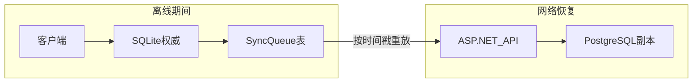

# 04 — 离线优先与同步策略

> **关联源文档**：`ai笔记调研项目图景/补充场景-核心共性与技术架构复用.md`、`0705调研报告/02-深度分析-可行性技术利润.md`、`ai笔记调研项目图景/基础信息/深度补充报告-NET10与应用场景.md`

---

## 一、为什么离线优先是硬性要求

创意工作者的离线触发情境（来自合成文档 §1.1）：

| 情境 | 频率 | 核心操作 |
|------|------|---------|
| 飞机、咖啡馆、深夜卧室 | 每日频繁 | 写作、角色创建、大纲调整 |
| 灵感碎片捕捉 | 随时 | 快速笔记、@实体链接 |
| 无稳定 WiFi 的 co-working | 偶发 | 完整章节编辑 + 矛盾检测 |

**架构含义**：SQLite 是主存储层，不是缓存。离线期间返回空列表或网络错误 = 产品直接出局。

---

## 二、分阶段同步策略

### 2.1 阶段对比

| 维度 | MVP（月 0–4） | Phase 2（月 6+） | Phase 3（月 12+） |
|------|--------------|-----------------|------------------|
| 设备数 | 单设备 | 多设备 | 多设备 + 协作 |
| 同步机制 | 无 / 手动导出 | SyncQueue 增量 | Yjs CRDT |
| 冲突解决 | N/A | Last-Write-Wins | CRDT 自动合并 |
| 云依赖 | 可选账户+备份 | 定时增量备份 | 实时 WebSocket |
| 协作 | 无 | 无 | 合著 / DM+玩家 |

### 2.2 MVP 策略详解

```
用户操作 → 立即写入 SQLite → UI 乐观更新
                ↓
         （可选）手动「备份到云」
                ↓
         加密 zip/blob → POST /api/backup
```

**刻意不做 MVP**：
- Yjs CRDT（NET10 报告：延迟同步 = 只是又一个笔记应用；同步才是长期差异化，但非 3 个月必需）
- 多设备实时同步
- 离线队列重放（无第二设备则无需队列）

**必须做 MVP**：
- 单 SQLite 文件 per project
- 自动本地保存（debounce ≤ 500ms）
- 导出 Markdown / 复制 `.worldforge.db` 即可完整迁移

### 2.3 Phase 2：SyncQueue + 增量备份



**冲突策略（单人多设备）**：Last-Write-Wins，基于 `UpdatedAt` + 设备 ID。  
**冲突 UI**：极少数情况下提示「云版本更新，是否合并？」— MVP 可不实现。

### 2.4 Phase 2+：Yjs CRDT 协作

```
实时协作层：Yjs CRDT ←→ SignalR WebSocketStream
离线队列层：SyncQueue 增量重放（单人场景备用）
```

.NET 10 `WebSocketStream` 将 Yjs 增量包作为标准 Stream 处理，与压缩、JSON 序列化管道组合。

**协作圈（Creative 场景，延后）**：
- 合著者 1–3 人：编辑级
- Beta 读者 5–20 人：评论 / 只读
- DM 与玩家 4–6 人：跑团实时视图（Phase 3+）

---

## 三、客户端 SQLite 部署形态

| 形态 | 优点 | 缺点 | 建议 |
|------|------|------|------|
| **PWA + sql.js / WASM** | 纯 Web、迭代快 | 性能、文件系统访问受限 | MVP 可行 |
| **Electron + better-sqlite3** | 完整文件系统、Scrivener 导入 | 包体积 | 备选桌面 |
| **Tauri + rusqlite** | 轻量 | 团队栈 .NET 为主时分裂 | 不推荐首发 |
| **MAUI 原生 SQLite** | 最佳移动体验 | 月 12 前禁止 | Phase 3 |

**早期选型影响**（见 [12-风险与刻意边界](./12-风险与刻意边界.md)）：
- Scrivener 导入需要可靠文件系统访问 → Electron 或桌面 PWA + File System Access API
- 若 MVP 纯浏览器 WASM，导入路径需 zip 上传而非直接读 `.scriv` 文件夹

**推荐路径**：
1. MVP：PWA + 用户显式「打开项目文件」/「导入 zip」
2. 月 4–6：Electron 壳（若 PWA 文件 API 不足）
3. 月 12+：评估 MAUI，不早于 Web 功能稳定

---

## 四、PWA 离线能力清单

| 能力 | 实现 | MVP |
|------|------|:---:|
| Service Worker 缓存静态资源 | Workbox | ✅ |
| 应用 shell 离线可开 | SW precache | ✅ |
| 数据离线读写 | SQLite WASM / 本地 API | ✅ |
| 后台同步备份 | Background Sync API | — |
| 安装到桌面 | manifest.json | ✅ |
| 推送通知（矛盾检测完成） | Web Push | — |

---

## 五、平台策略：PWA 优先，MAUI 延后

来自 02 深度分析 §5.3 与合成文档 §风险三：

| 规则 | 说明 |
|------|------|
| 月 0–12 **禁 MAUI** | 工具链成熟度、调试、热重载不如 Web |
| Web 承担 80% 迭代 | 功能验证、社区反馈、快速修复 |
| MAUI 只做差异化原生能力 | 相机、HealthKit、极致离线 — Creative 场景非必需 |
| MAUI 退出标准 | 若开发速度 < Web 30%，继续 PWA + Electron |

---

## 六、数据迁移与灾难恢复

| 场景 | 用户操作 | 系统行为 |
|------|---------|---------|
| 换电脑 | 复制 `.worldforge.db` 或恢复云备份 | 打开项目即可 |
| 损坏数据库 | 从最近云备份 / 本地 Time Machine | 最多丢上次备份后变更 |
| 卸载重装 | 许可证 + 云备份 | Gumroad 密钥重新激活 |
| 导出归档 | Markdown + 实体 JSON | 无供应商锁定 |

**反 SaaS 叙事**（对标 Chronicler）：数据以开放格式存本地，平台锁定为零。

---

## 七、与 PostgreSQL 副本的一致性

云侧 PostgreSQL **不参与** MVP 实时读写路径。其职责：

1. 用户账户与许可证
2. 加密项目备份 blob（可选）
3. Phase 2 起：多设备 SyncQueue 合并目标

**副本滞后**可接受：创意写作是单人权威写入，非银行账本强一致。

---

## 八、相关文档

- [03-数据模型与存储](./03-数据模型与存储.md) — SyncQueue 表结构
- [07-后端与可选云服务](./07-后端与可选云服务.md) — 备份 API
- [09-MVP范围与路线图](./09-MVP范围与路线图.md) — 阶段时间表

---

*上一篇：[03-数据模型与存储](./03-数据模型与存储.md) · 下一篇：[05-AI矛盾检测管线](./05-AI矛盾检测管线.md)*
