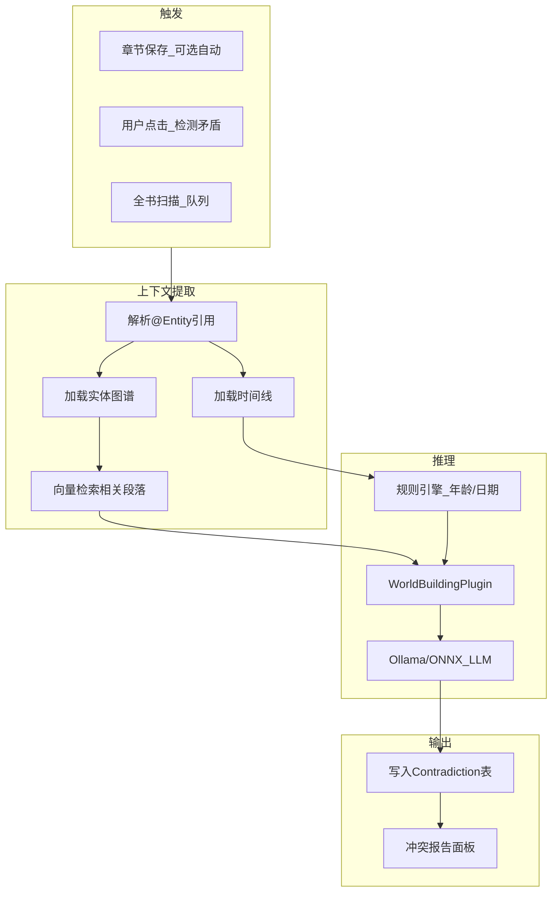
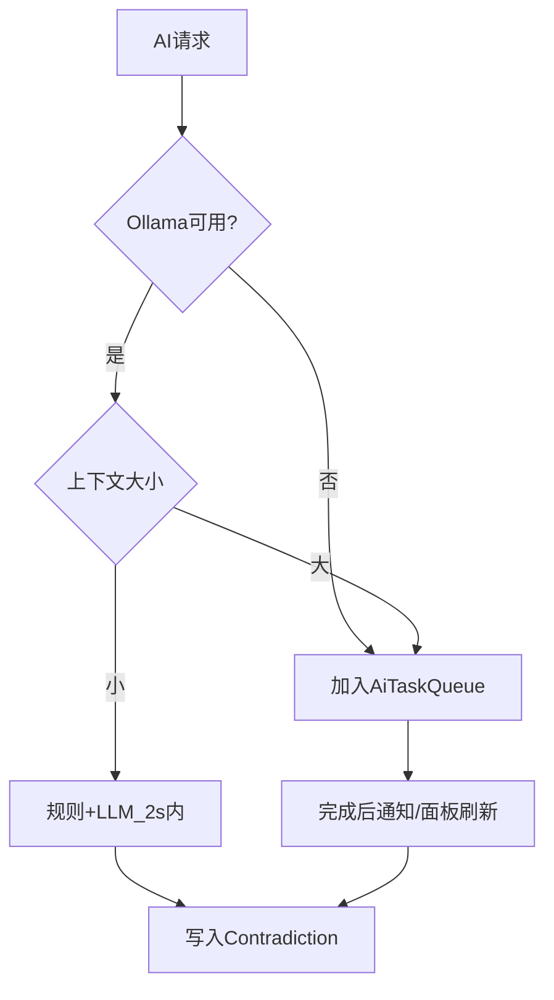

# 05 — AI 矛盾检测管线

> **关联源文档**：`0705调研报告/AI笔记垂直场景/A-创意工作者工作室.md`、`ai笔记调研项目图景/细分场景/场景6-创意工作者-深度调研.md`、`ai笔记调研项目图景/补充场景-核心共性与技术架构复用.md`

---

## 一、产品定位：辅助非代写

创作者对 AI 的真实需求（场景6 §4.3）：

| 需要 | 不需要 |
|------|--------|
| 理解世界观上下文后的精准建议 | 通用 ChatGPT 整章代写 |
| **矛盾检测**（杀手功能） | 风格不一致的 AI 正文 |
| 名称 / 实体自动补全 | 陪伴式聊天 |
| 语义搜索「所有提到蓝眼睛的场景」 | 无审查的 AI 内容直接入库 |

**KPI**：6 月内 **≥ 60% 付费用户每周使用矛盾检测**（A 方案 §5.2）。

---

## 二、管线总览



---

## 三、处理阶段详解

### 3.1 触发方式

| 模式 | 说明 | MVP |
|------|------|:---:|
| 手动检测 | 用户点击「检测本章 / 全书」 | ✅ |
| 保存时检测 | `ProjectSettings.AutoDetectOnSave` | ✅ 可选默认关 |
| 后台队列 | 全书扫描；大项目分批 | ✅ |
| 实时输入提示 | 输入 @实体 时轻量校验 | Phase 2 |

### 3.2 上下文提取

```csharp
public record ContradictionContext
{
    public Guid ProjectId { get; init; }
    public Guid? FocusDocumentId { get; init; }
    public IReadOnlyList<WorldCharacter> Characters { get; init; }
    public IReadOnlyList<TimelineEvent> Timeline { get; init; }
    public IReadOnlyList<ManuscriptExcerpt> RelevantExcerpts { get; init; }
    public IReadOnlyList<EntityLink> Links { get; init; }
}
```

**RelevantExcerpts 来源**：
1. 当前章节全文
2. `EntityLink` 关联章节
3. `EF.Functions.VectorDistance` 语义相近段落（Top 10）
4. 同实体所有 `Aliases` 出现位置

### 3.3 规则引擎（快速路径，< 100ms）

不依赖 LLM 的确定性检查：

| 规则 | 示例 |
|------|------|
| 年龄-时间线 | 生于 1995，事件 2024，正文写 25 岁 → 应为 29 |
| 日期顺序 | 时间线事件 A 在 B 之后，正文写 A 发生在 B 之前 |
| 别名不一致 | 同章 Aldric / Aldrich 无 Alias 声明 |
| 生死状态 | 时间线已死亡，后章仍活动无解释 |

规则命中直接写入 `Contradiction`，可跳过 LLM 以保 SLA。

### 3.4 LLM 推理（WorldBuildingPlugin）

```csharp
public class WorldBuildingPlugin
{
    [KernelFunction("detect_contradiction")]
    public async Task<ContradictionResult[]> DetectContradictionAsync(
        ContradictionContext ctx,
        CancellationToken ct)
    {
        // Prompt 含：世界观规则摘要、实体卡片、 excerpts、输出 JSON Schema
    }
}
```

**技术栈**：
- `Microsoft.Extensions.AI.IChatClient` — 统一抽象
- MVP 实现：`OllamaChatClient`（`phi4-mini` 或用户自选）
- 可选：`OnnxRuntime` 跑更小模型做名称补全

```csharp
IChatClient aiClient = new OllamaChatClient(
    new Uri("http://localhost:11434/"),
    project.Settings.PreferredOllamaModel);
```

**输出 Schema**（强制 JSON mode）：

```json
{
  "contradictions": [
    {
      "type": "AgeMismatch",
      "severity": "Error",
      "summary": "第3章称角色25岁，时间线显示应为29岁",
      "sourceDocumentId": "...",
      "sourceExcerpt": "...",
      "targetDocumentId": "...",
      "targetExcerpt": "...",
      "relatedEntityId": "...",
      "suggestion": "将第3章年龄改为29岁，或调整出生日期"
    }
  ]
}
```

### 3.5 冲突报告面板 UI

| 元素 | 行为 |
|------|------|
| 列表 | 按 Severity 排序，过滤 Open / Resolved |
| 跳转 | 点击打开双章节分屏对照 |
| 操作 | 标记已解决 / 误报 / 采纳建议 |
| 批次 | 显示 DetectionRunId 与耗时 |

---

## 四、其他 AI 能力（MVP 范围）

| 能力 | 实现 | SLA |
|------|------|-----|
| 实体名称补全 | 字符串前缀 + 向量相似 | < 200ms |
| 语义搜索 | Embedding + VectorDistance | < 500ms |
| 矛盾检测（单章） | 规则 + LLM | **< 2s** |
| 全书扫描 | 分批队列 + 进度条 | 异步，可后台 |

**性能 SLA**（合成文档 §风险四）：任何设备端 AI 交互 **< 2 秒**；超时则降级为「已加入队列，完成后通知」。

---

## 五、降级与排队策略



| 条件 | 行为 |
|------|------|
| Ollama 未安装 | 引导安装；规则引擎仍可用 |
| 中低端 Android（Phase 3） | 仅规则 + 云端模块（Phase 2 可选） |
| 全书 > 50 万字 | 按章分批，每批 ≤ 8k tokens |

---

## 六、刻意不做

| 功能 | 原因 |
|------|------|
| 整章 AI 代写 | 版权、风格、定位 |
| CandyAI 式角色陪伴聊天 | KPI 是 export + 矛盾检测，不是 DAU 聊天 |
| AI 内容无审查入库 | 对标 Loreum「审查队列」；我们不做生成故不适用 |
| MVP 依赖云端 LLM | 离线优先战略；云增强见 Phase 2 |

---

## 七、Phase 2：云增强模块（$19/年）

走公司 NewAPI + 订阅计量（见 [10-公司资产对接](./10-公司资产对接.md)）：

| 能力 | 本地 | 云增强 |
|------|------|--------|
| 矛盾检测 | ✅ | 更强模型、更大上下文 |
| 角色对话检验人格一致性 | — | ✅ Agent Phase 2 |
| Embedding | 本地小模型 | 可选云端 |

**原则**：离线优先不变；云为可选加油包，非核心路径。

---

## 八、竞品对标

| 产品 | AI 方案 | WorldForge 差异 |
|------|---------|----------------|
| PlotForge | Ollama 本地 | + EF 向量搜索 + 规则引擎分层 |
| Ishvana | Divinity Engine / Lorekeeper | 开源栈 + 引擎可延伸 B/C |
| Scrivener | 无 | — |
| World Anvil | 无本地 AI | 离线 + 写作一体 |
| Loreum | MCP + 审查队列 | 我们聚焦检测非生成 |

---

## 九、测试要点

| 测试 | 方法 |
|------|------|
| 年龄矛盾 |  fixture 项目：已知冲突 → 必检出 |
| 误报率 | Beta 用户标记 FalsePositive 比例 < 20% |
| 2s SLA | CI 基准机单章检测 P95 < 2000ms |
| Ollama 离线 | Mock 不可用 → 队列 + 规则仍运行 |

---

## 十、相关文档

- [03-数据模型与存储](./03-数据模型与存储.md) — Contradiction 实体
- [10-公司资产对接](./10-公司资产对接.md) — 云 AI Phase 2
- [12-风险与刻意边界](./12-风险与刻意边界.md) — AI 伦理与 scope

---

*上一篇：[04-离线优先与同步策略](./04-离线优先与同步策略.md) · 下一篇：[06-前端与编辑器](./06-前端与编辑器.md)*
