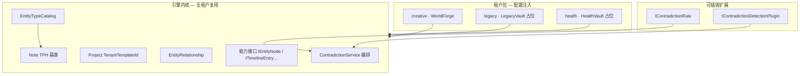
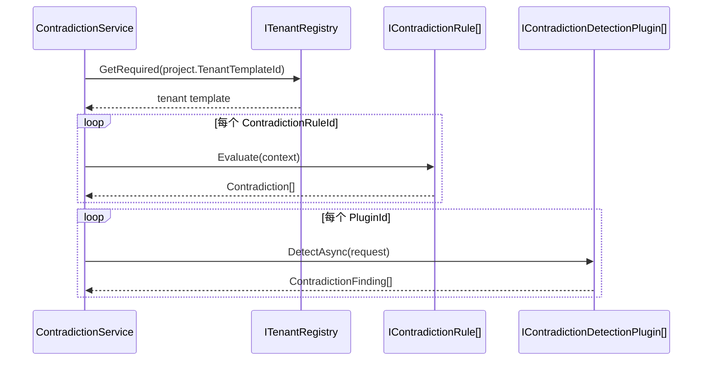
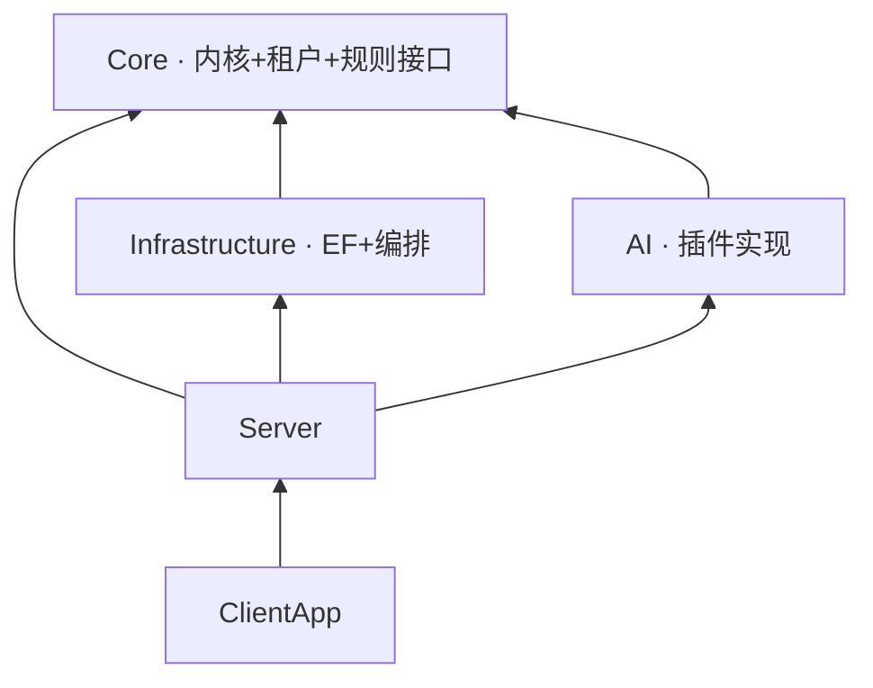

# 13 — 复用架构与租户引擎

> **关联源文档**：`ai笔记调研项目图景/补充场景-核心共性与技术架构复用.md`、`0705调研报告/01-总体项目选型筛选报告.md`  
> **代码映射**：见 [14-代码库映射与实现状态](./14-代码库映射与实现状态.md)

---

## 一、设计目标

WorldForge MVP 聚焦 **Creative 单场景 GTM**，但引擎从第一天起按 **「一引擎、五垂直、租户注入差异」** 设计，避免：

1. 月 12 做 LegacyVault 时 fork 代码或大规模重写
2. 矛盾检测、实体图谱、TipTap、SQLite 等能力在各场景重复实现
3. Core 层引用 AI / HTTP / EF，导致无法单测与复用

**战略约束**（来自 01 总体筛选报告）：

- **代码可复用**：共享 `WorldForge.Core` + `Infrastructure` + `AI` 基建
- **GTM 不可复用**：WorldForge ≠ LegacyVault 品牌与渠道；月 0–12 **不并行** 获取 B/C 用户

---

## 二、总体结构



### 2.1 三层边界

| 层级 | 命名空间 / 目录 | 内容 | 变更频率 |
|------|----------------|------|---------|
| **共享内核** | `Core/Entities/` | `Note`、`Project`、`Contradiction`、`EntityLink`、`EntityRelationship` | 低 |
| **能力抽象** | `Core/Abstractions/` | `IEntityNode`、`ITimelineEntry`、`IAgeAwareEntity`、`IContradictionRule`… | 低 |
| **租户扩展** | `Core/Tenants/{Creative,Legacy,Health}/` | 场景实体 + `*TenantTemplate` | 中（PMF 后加租户） |

**禁止**：

- 在 `Core/Entities/` 放 `WorldCharacter` 等场景专有类型
- 在 `Core` 引用 `WorldForge.AI` 或 `Infrastructure`
- 用 `if (tenant == "legacy")` 散落业务分支 — 差异进模板与注册表

---

## 三、租户模板（ITenantTemplate）

引擎通过 **租户模板** 声明场景差异，运行时由 `ITenantRegistry` 解析。

```csharp
public interface ITenantTemplate
{
    string Id { get; }                              // "creative" | "legacy" | "health"
    string DisplayName { get; }                     // 产品品牌名
    SecurityTier SecurityLevel { get; }
    IReadOnlyList<Type> EntityTypes { get; }        // TPH 子类列表
    IReadOnlyList<string> PluginIds { get; }         // AI 插件字符串 ID
    IReadOnlyList<string> ContradictionRuleIds { get; } // 确定性规则 ID
    string SkinId { get; }                           // 前端 CSS 皮肤
    FeatureFlags Features { get; }                   // 功能开关
}
```

### 3.1 当前注册租户

| Id | 产品 | SecurityTier | 矛盾检测 | 实体数 | 状态 |
|----|------|:------------:|:--------:|:------:|------|
| `creative` | WorldForge | Standard | ✅ | 6 | **MVP 启用** |
| `legacy` | LegacyVault | E2EE | ❌ | 3 | 占位，月 12–18 |
| `health` | HealthVault | Enhanced | ❌ | 3 | 占位，条件触发 |

### 3.2 项目与租户绑定

```csharp
public class Project
{
    public string TenantTemplateId { get; set; } = "creative";  // 创建时从 ITenantContext 写入
    // ...
}
```

- **编排器**（如 `ContradictionService`）读取 `Project.TenantTemplateId`，而非全局静态配置
- 同一引擎进程可服务多租户 API；MVP 前端默认 `ITenantContext` = creative

### 3.3 API 暴露

| 端点 | 用途 |
|------|------|
| `GET /api/tenants` | 租户列表（skinId、安全等级、功能开关） |
| `GET /api/tenants/{id}` | 实体类型名、插件 ID、规则 ID |

前端 Phase 1：按 `skinId` 加载 CSS 变量（Creative = 沉浸式深色）。

---

## 四、TPH 与 EntityTypeCatalog

所有内容类型继承 `Note`，EF Core 使用 **Table Per Hierarchy** + `Discriminator` 列。

**关键设计**：DbContext **不硬编码** Creative 六类 discriminator，而从 `EntityTypeCatalog` 动态注册：

```
启动 AddWorldForgeCore()
    → 各 TenantTemplate 注册 EntityTypes
    → EntityTypeCatalog 汇总全部 CLR 类型
    → OnModelCreating: foreach (name, type) discriminator.HasValue(type, name)
```

**好处**：

- 新增 `Tenants/Field/` 实体 + 模板 → 只注册，不改 DbContext 编排
- 统一语义搜索、导出管线作用于 `Note` 基类

**刻意简化（MVP）**：

- 单 SQLite 文件包含 **全部已注册** 租户类型（非按租户物理分库）
- Phase 2 可按 `TenantTemplateId` 分文件或分 Migration 策略

---

## 五、能力接口（跨场景复用）

规则、搜索、UI 卡片应依赖 **接口** 而非具体 `WorldCharacter`：

| 接口 | 语义 | Creative 实现 | Legacy 实现 | Health 实现 |
|------|------|---------------|-------------|-------------|
| `IEntityNode` | 图谱节点 | `WorldCharacter` | `DigitalAccount` | `SymptomRecord` |
| `ITimelineEntry` | 时间线 | `TimelineEvent` | `LifeEvent` | `DoctorVisit` |
| `IAgeAwareEntity` | 年龄推导 | `WorldCharacter` | — | — |
| `IRelationshipEdge` | 关系边 | `EntityRelationship` | 同左 | 同左 |

文档映射表（03 §九）在代码中已落实为占位类型，见 `Core/Tenants/Legacy/Entities/` 与 `Health/Entities/`。

---

## 六、EntityRelationship（通用关系边）

原设计 `CharacterRelationship` 仅服务 Creative。复用架构改为 **内核级** `EntityRelationship`：

```csharp
public class EntityRelationship : IRelationshipEdge
{
    public Guid ProjectId { get; set; }
    public Guid FromEntityId { get; set; }
    public Guid ToEntityId { get; set; }
    public string RelationType { get; set; }  // ally / beneficiary / contraindication …
}
```

| Creative | Legacy | Health |
|----------|--------|--------|
| 角色同盟 | 账户受益人 | 症状–药物 |

同一表结构，UI 与规则按 `RelationType` 词典区分场景。

---

## 七、矛盾检测：规则 + 插件双轨



| 轨道 | 接口 | 位置 | SLA | 示例 |
|------|------|------|-----|------|
| **规则** | `IContradictionRule` | Core/Rules | < 100ms | `AgeTimelineContradictionRule` |
| **插件** | `IContradictionDetectionPlugin` | AI/Plugins | < 2s | `WorldBuildingPlugin` + Ollama |

**关联方式**：字符串常量 `ForgeRules.*` / `ForgePlugins.*` — Core 不引用 AI 程序集。

**注册**：

```csharp
// Core
services.AddSingleton<IContradictionRule, AgeTimelineContradictionRule>();

// AI
services.AddSingleton<IContradictionDetectionPlugin, WorldBuildingPlugin>();
```

租户模板通过 ID 列表 **筛选** 已注册实例，而非 new 具体类。

---

## 八、模块依赖（复用视角）



| 依赖 | 允许 | 禁止 |
|------|------|------|
| AI → Core | ✅ 实现 `IContradictionDetectionPlugin` | — |
| Core → AI | — | ❌ |
| Infrastructure → Core | ✅ | — |
| Core → Infrastructure | — | ❌ |

---

## 九、扩展新垂直场景（操作手册）

以假设 **D 场景「现场记录」** 为例：

### Step 1 — 实体包

```
Core/Tenants/Field/Entities/
    SiteRecord.cs      : Note, IEntityNode
    FieldEvent.cs      : Note, ITimelineEntry
```

### Step 2 — 租户模板

```csharp
public sealed class FieldTenantTemplate : ITenantTemplate
{
    public string Id => "field";
    public IReadOnlyList<Type> EntityTypes { get; } = [typeof(SiteRecord), typeof(FieldEvent)];
    public IReadOnlyList<string> PluginIds { get; } = [ForgePlugins.FieldReport];
    // ...
}
```

### Step 3 — 注册

```csharp
// DependencyInjection.AddWorldForgeCore()
EntityTypeCatalog.RegisterFromTenants([..., FieldTenantTemplate.Instance]);
services.AddSingleton<ITenantRegistry>(...); // 加入模板实例
```

### Step 4 — （可选）规则 / 插件

- `Core/Rules/FieldConsistencyRule.cs` : `IContradictionRule`
- `AI/Plugins/FieldReportPlugin.cs` : `IContradictionDetectionPlugin`
- DI 注册 + 模板 ID 列表引用

### Step 5 — 前端

- 新品牌壳 + `skinId`
- 实体表单组件可按 `EntityTypes` 动态路由（Phase 2）

**无需修改**：`ContradictionService` 主流程、`EntityTypeCatalog` 机制、`WorldForgeDbContext` 类结构。

---

## 十、与五垂直路线图对齐

```
月 0–12    creative  · WorldForge MVP + PMF
月 12–18   legacy    · LegacyVault + E2EE
月 18–24   health    · 条件验证
月 24+     field / elder · 待路线图确认
```

| 沉淀模块 | 复用于 | 改造量 |
|---------|--------|:------:|
| SQLite + TPH 引擎 | 全场景 | 低 |
| 租户模板 + Catalog | 全场景 | 低 |
| 实体图谱框架 | B/C/D/E | 中（换 EntityTypes） |
| 矛盾检测编排 | 全场景 AI 基建 | 低 |
| TipTap 编辑器 | B 信件、C 笔记 | 低 |
| E2EE | B/C | 中（SecurityTier 切换） |

---

## 十一、相关文档

- [03-数据模型与存储](./03-数据模型与存储.md) — TPH 字段级定义
- [05-AI矛盾检测管线](./05-AI矛盾检测管线.md) — Ollama 与 Prompt
- [14-代码库映射与实现状态](./14-代码库映射与实现状态.md) — 当前实现清单
- [12-风险与刻意边界](./12-风险与刻意边界.md) — 月 0–12 禁止五场景 GTM

---

*上一篇：[12-风险与刻意边界](./12-风险与刻意边界.md) · 下一篇：[14-代码库映射与实现状态](./14-代码库映射与实现状态.md)*
